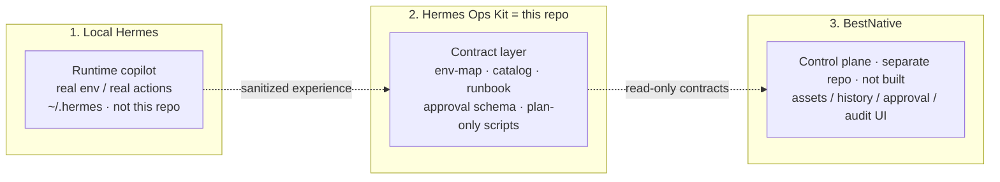
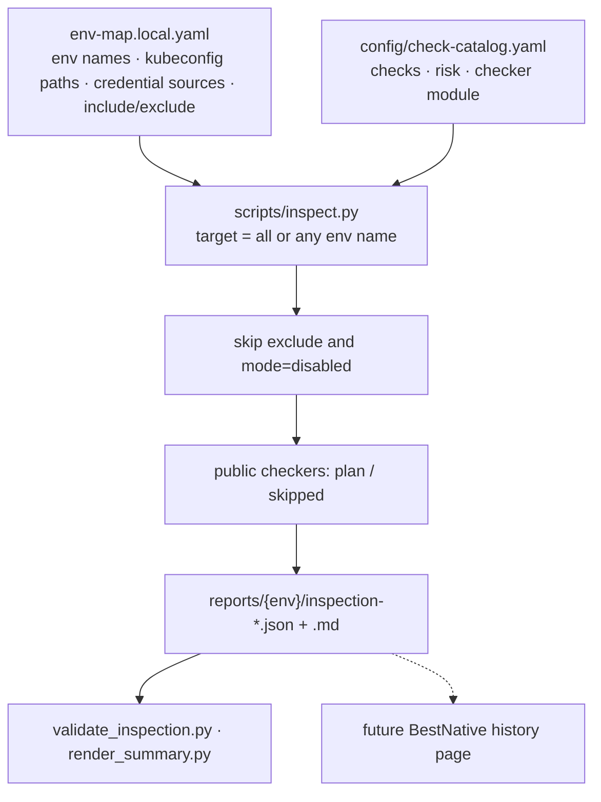
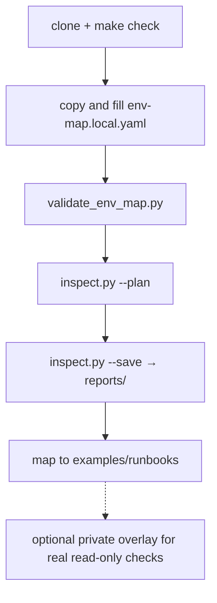

<p align="center">
  
</p>

<h1 align="center">Hermes Ops Kit</h1>

<p align="center">
  Ops instructions for Hermes: how to describe environments, what an inspection report looks like, and which checklist to run first
</p>

<p align="center">
  <a href="README.md">简体中文</a> · <b>English</b>
</p>

<p align="center">
  
  
  
  
</p>

> **Not a Hermes feature branch, and not a fork.** Hermes is still the copilot on your machine that chats, reasons, and acts (`~/.hermes`). This repo only supplies the formats and examples it should follow. Public scripts are **plan-only**: they do not connect to your Kubernetes, SSH, or databases.

Product write-up: [docs/product.en.md](docs/product.en.md)

---

## What this actually does

If ops knowledge only lives in chat logs and one person's head, the next incident the AI guesses commands again. This repo writes three things as **stable formats** that both you and Hermes can reuse:

1. **Environment map** (`env-map`)
   One YAML file: which environments exist, where the kubeconfig **path** is, where credentials come **from** (file / env / K8s Secret… never the password itself), and which checks to run. Disable middleware you do not have.

2. **Inspection report** (`inspect.py`)
   Walk the map and catalog, emit JSON + Markdown with a fixed shape: ok / warning / skipped. The public template **plans only and does not touch the cluster**. Real cluster reads belong in your private overlay.

3. **Diagnostic checklist** (runbook metadata)
   Abnormal checks point at an L0 list, for example “pod not ready: look at these things, do not delete yet.” Metadata, not a dump of production SOPs.

After clone you can: `make check` → copy `env-map.example.yaml` → `inspect.py --plan` → open `examples/runbooks/`.
After clone you **cannot**: inspect production automatically, or open a BestNative web UI.

```text
you write env-map.local.yaml
        ↓
python3 scripts/inspect.py test --plan --save
        ↓
reports/test/inspection-*.json   (mostly skipped/plan in public)
        ↓
suggestion → examples/runbooks/k8s-pod-abnormal-diagnostic.yaml
        ↓
hand those three to Hermes as facts, instead of inventing kubectl
```

| Role | Job |
|---|---|
| **You** | Fill a local env-map; choose which checks |
| **This repo** | Define report/checklist shape; ship a runnable skeleton |
| **Hermes** | Read those files to diagnose; high-risk ops still need approval contracts |
| **Private overlay** | Optional; real read-only kubectl / DB checks on your machine |
| **BestNative** | A future web UI; not here; separate repo that will read this kit |

---

## Positioning

| What it is | What it is not |
|---|---|
| Sanitized **contracts** for inspection, runbooks, and approval | Hermes Agent source or a `~/.hermes` backup |
| A stable facts layer for AI (env-map + check catalog) | A chatbot that guesses commands |
| A plan-only public skeleton plus a private overlay hook | A tool that inspects production the moment you clone it |
| A read-only data source for a future control plane | A live BestNative / ops SaaS |

---

## Three layers

Keep these layers separate. Do not merge them into one repository.

```text
Local Hermes   = private operational copilot; real env-map and real ops loop (not this repo)
Hermes Ops Kit = this repo: sanitized templates, schemas, script skeletons, safety rules, examples
BestNative     = future Web/API control plane (separate codebase): assets, history, approval, audit
```



| Layer | Role | This repo | Must not appear here |
|---|---|---|---|
| **Local Hermes** | Private copilot, real environments, real actions | not included | real env-map, full skills, local reconnaissance |
| **Hermes Ops Kit** | Sanitized templates, schemas, plan-only scripts, L0 examples | **this repository** | real IPs, hostnames, password values, raw logs |
| **BestNative** | Web/API for assets, history, approval, audit | separate repo, not started | adapter implementation, approval state-machine code |

A private overlay for real read-only checks stays on your machine, next to Hermes. **Do not commit it back into Ops Kit.**

End-state vision (planning only): [`future-product/`](future-product/README.md)

---

## Capabilities and advantages

**Available now**

- Describe environments, credential **sources** (not values), and which checks to run
- Dispatch inspection from the catalog into stable JSON / Markdown (plan-only in public)
- L0 runbook metadata: K8s / MySQL / Redis / RabbitMQ / ES / node / ArgoCD / Longhorn
- Approval and audit schema templates (field contracts, not an approval product)
- `make check`: compile, sanitize, contract validation, unit tests

**Why this split**

- **Private-first**: secrets and topology stay local; GitHub gets the skeleton
- **Facts before reasoning**: fewer hallucinated commands
- **Decoupled from runtime**: contracts are not glued to Hermes source or a model bump
- **Optional middleware**: `mode: disabled`; credentials are not locked to `.pw` files
- **Control-plane ready**: BestNative does not invent a second inspection JSON

---

## How it works



Credentials are **sources** only (`file` / `env` / `k8s_secret` / `external_secret` / `manual`). A `.pw` file is one `file` example, not a requirement. Unused middleware: `mode: disabled`, and omit it from `inspection.include`.

Real read-only checks live in a **private overlay**. Do not commit topology or credential paths.

---

## How to use



Step-by-step (env-map fields, inspect flags, Hermes): [docs/clone-and-run.en.md](docs/clone-and-run.en.md)

```bash
git clone <REPO_URL> hermes-ops-kit
cd hermes-ops-kit
make check
```

`make check` validates **this repository** only. It does not inspect a running local Hermes.

### 1. Private env-map

```bash
cp config/env-map.example.yaml config/env-map.local.yaml
```

Fill environment names, kubeconfig **paths**, credential **sources**, and `inspection.include`. Disable unused middleware. Never put passwords or kubeconfig contents. The file is gitignored.

```bash
python3 scripts/validate_env_map.py config/env-map.local.yaml --expect-env test --catalog config/check-catalog.yaml
```

Replace `test` with an environment name from your env-map.

### 2. Run the inspection skeleton

```bash
python3 scripts/inspect.py test --config config/env-map.local.yaml --catalog config/check-catalog.yaml --plan --json
python3 scripts/inspect.py test --config config/env-map.local.yaml --json --save
```

`target` may be `all` or **any** env-map name. Public `--plan` only plans. `--execute-readonly` stays skipped without a private overlay. Save paths go to stderr; stdout stays JSON.

Output (do not commit):

```text
reports/<env>/inspection-<run_id>.json
reports/<env>/inspection-<run_id>.md
```

```bash
python3 scripts/render_summary.py reports/<env>/inspection-<run_id>.json --only-abnormal
```

`suggestion` points at a runbook name, for example `k8s-pod-abnormal-diagnostic` → `examples/runbooks/k8s-pod-abnormal-diagnostic.yaml`.

### 3. Onboarding candidate

```bash
python3 scripts/onboard.py --env test --output config/env-map.generated.yaml --force
```

Public onboard does **not** scan a cluster. Review before merging anything into `env-map.local.yaml`.

### 4. Real checks and Hermes

Real read-only checks live in a **private overlay** outside this repo: [docs/private-checker-guide.en.md](docs/private-checker-guide.en.md). This kit does not auto-attach to Hermes — point the agent at the env-map, runbooks, and reports. BestNative will read the same contracts later; there is no Web UI now.

Contract flow: [docs/end-to-end-example.en.md](docs/end-to-end-example.en.md) · Docs index: [docs/README.en.md](docs/README.en.md)

---

## Repository layout

```text
hermes-ops-kit/
├── README.md / README.en.md
├── SECURITY.md / CONTRIBUTING.md / LICENSE
├── Makefile                  make check = repository gate
├── config/                   env-map example, catalog, schemas
├── scripts/                  inspect / onboard / validators (no live systems in public)
├── examples/runbooks/        sanitized L0 runbook metadata
├── templates/                JSON / YAML / Markdown templates
├── tests/                    unit and contract tests
├── docs/                     docs and logo (start at docs/README.md)
├── future-product/           end-state vision (planning only)
└── .github/workflows/        make check CI
```

Do not commit: `config/env-map.local.yaml`, `config/env-map.generated.yaml`, `reports/`, `*.pw` / `*.key` / `.env`.

---

## Provides / does not provide

**Provides**

- env-map, check catalog, inspection JSON contracts
- plan-only checkers and private overlay guidance
- L0 runbook metadata examples
- approval/audit schema and request template
- sanitize scan, publish-guard, `make check`
- BestNative **read-only** consumption contract

**Does not provide**

- passwords, tokens, private keys, kubeconfig contents
- default connections to real clusters or middleware
- automatic high-risk execution or a production Web UI
- a replacement for Prometheus / Elasticsearch / Alertmanager
- a working BestNative deployment

---

## Safety model

1. Real config stays in local `env-map.local.yaml`.
2. Discovery writes `env-map.generated.yaml` only; humans promote it.
3. L0 read-only needs no approval; L2/L3 need approval, rollback, and audit contracts.
4. PRD defaults to command-generation unless hard RBAC, approval, and audit exist.

Details: [SECURITY.md](SECURITY.md) · [docs/safety-model.md](docs/safety-model.md) · Pre-publish review: [docs/public-release-review.md](docs/public-release-review.md)

Optional local Hermes health check (**not** a gate; may touch `~/.hermes`):

```bash
make health-check
```

---

## BestNative

BestNative is **not this repo and is not integrated yet**. It is a future separate Web/API control plane. This kit only supplies the contracts it will read.

```text
Ops Kit emits contracts  →  BestNative reads history/catalog  →  later bridge to Hermes execution
```

| Now | Later (BestNative repo) |
|---|---|
| This repo defines JSON/YAML shapes and L0 examples | Pages and APIs: history, catalog, approval queue |
| `inspect.py` writes local `reports/` | Reads `HERMES_OPS_KIT_PATH`, **does not mutate kit sources** |
| Approval is schema-only | L2/L3 only after a state machine exists |
| No execution API | Call Hermes only after RBAC / audit / rollback |

The next product step is **not** a control plane inside this repo. Build BestNative as its own repository, then read this kit: [docs/bestnative-integration.en.md](docs/bestnative-integration.en.md)

- [docs/product.en.md](docs/product.en.md) — responsibility split
- [docs/bestnative-contract.en.md](docs/bestnative-contract.en.md) — readable files and inspection JSON fields
- [docs/bestnative-integration.en.md](docs/bestnative-integration.en.md) — read-only → approval → execution

---

## Roadmap

| Stage | What |
|---|---|
| `v0.3-prep` | GitHub gates, BestNative read-only contract draft |
| `v0.4-preview` (current) | env-map + catalog inspection framework; public checkers plan-only; L0 runbooks |
| `v0.5` | Public-release human review via [public-release-review.md](docs/public-release-review.md) |
| `v1.0` | BestNative read-only control plane (**separate repo**) consumes these contracts |

Phase plan: [docs/implementation-roadmap.md](docs/implementation-roadmap.md) · Status: [docs/project-status.en.md](docs/project-status.en.md)

---

## Contributing

See [CONTRIBUTING.md](CONTRIBUTING.md). Do not commit real IPs, hostnames, credentials, or raw incident logs.

## License

MIT
