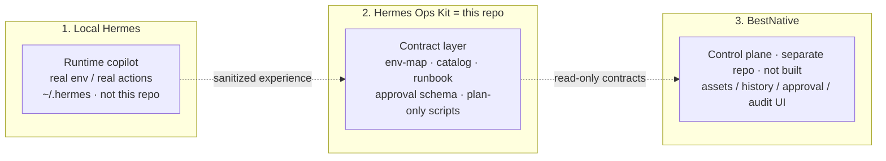
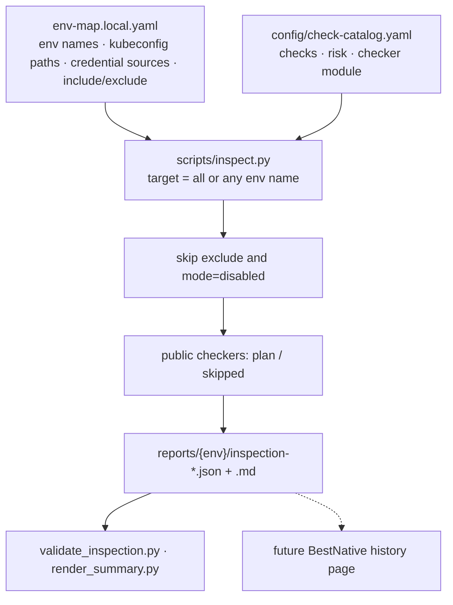
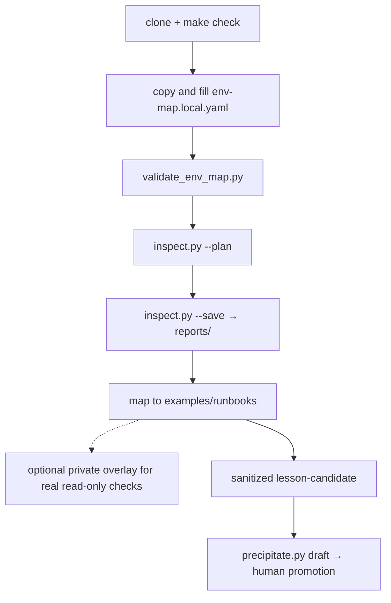

<p align="center">
  
</p>

<h1 align="center">Hermes Ops Kit</h1>

<p align="center">
  An <b>AI SRE workflow kit</b> for Hermes: inspect from facts, diagnose from checklists, change only through an approval shape
</p>

<p align="center">
  <a href="README.md">简体中文</a> · <b>English</b>
</p>

<p align="center">
  
  
  
  
</p>

> **This is a workflow, not an ops platform, and not a Hermes plugin.** Hermes on your machine does the work (`~/.hermes`). This repo writes that workflow as reusable files: env-map → inspection report → diagnostic checklist → approval shape. Public scripts are **plan-only** and do not touch your cluster.

Product write-up: [docs/product.en.md](docs/product.en.md)

---

## What this is

**One line:** turn “AI for SRE” from ad-hoc chat into a **repeatable, shareable, facts-first workflow**.

It **is** a workflow (fixed steps and I/O). It is **not** a workflow engine (no scheduler, no cron against production, no “click to mutate the cluster” UI). Hermes is the engine; this repo is the playbook and the sockets.

```text
without the kit: open Hermes → describe the cluster in chat → AI invents kubectl → the thread is gone → forwarding it may leak secrets
with the kit: fill env-map → inspect emits the same JSON shape → map to a runbook → Hermes follows the list → changes go through approval fields
```

| | Chat with Hermes only | This workflow |
|---|---|---|
| Environment facts | Re-explained every thread | `env-map.local.yaml`, reusable |
| Inspection results | Chat logs, different every time | Stable JSON, later UI-ready |
| How to diagnose | Improvised | L0 checklist: look first, do not delete |
| Share with a teammate | Copy `~/.hermes` or paste logs | Public skeleton only; secrets stay local |
| Later web UI | Invent a new report format | BestNative reads the same contracts |

After clone: `make check` → copy env-map → `inspect.py --plan` → `examples/runbooks/`.
After clone you **cannot**: auto-inspect production, open BestNative, or let Hermes skip approval to change the cluster.

---

## Is this already a crowded category

The *slogan* is crowded. In 2026 every vendor says AI SRE, runbooks, and workflows. The *slot* is not: who runs, where data goes, and what you can open-source.

| Kind | Examples | vs this repo |
|---|---|---|
| Hosted AI SRE | Resolve.ai, Cleric, Traversal, Datadog Bits AI | Their cloud agent reads your telemetry. We **do not host**; the agent is your Hermes |
| Incident management + AI | incident.io, Rootly, PagerDuty | You buy on-call / Slack workflow. We have no paging, no status page |
| Runbook engines that execute | Rundeck, StackStorm, Ansible | Their engine runs commands. We **refuse to execute** in public; we ship report shape |
| Check frameworks | kube-bench, InSpec | They scan clusters, but they are not an LLM workflow contract with approval fields |
| This repo | Hermes Ops Kit | A shareable skeleton for a **local Hermes you already run**: env-map / inspection JSON / checklists / approval shape. Secrets stay home |

So this is not another “AI that fixes prod for you” product. It is the layer that stops a private copilot from guessing kubectl every time, and lets you publish the workflow without publishing `~/.hermes`.

If you do not use Hermes and want a SaaS click-to-repair, use the hosted products. If you have Hermes, cannot send the cluster out, and still want to open-source the workflow, that is this kit.

---

## Four artifacts in the workflow

1. **Environment map** (`env-map`) — environments, kubeconfig path, credential sources (not values), which checks. Disable what you do not have.
2. **Inspection report** (`inspect.py`) — JSON + Markdown. Public template plans only; real reads go in a private overlay.
3. **Diagnostic checklist** (runbook metadata) — e.g. what to look at for a bad pod. Shape, not a dump of production SOPs.
4. **Lesson draft** (`precipitate.py`) — after an incident, write an already-sanitized lesson-candidate; the script emits an L0 runbook draft. Public code does not read `~/.hermes`; promoting into `examples/runbooks/` still needs a human.

```text
env-map.local.yaml
        ↓
inspect.py --plan --save
        ↓
reports/.../inspection-*.json
        ↓
examples/runbooks/k8s-pod-abnormal-diagnostic.yaml
        ↓
Hermes uses these as facts → production changes still need the approval shape
        ↓
sanitized lesson-candidate → precipitate.py → human promotion back into runbooks
```

| Role | In this workflow |
|---|---|
| **You** | Fill the local map; choose checks |
| **This repo** | Define the steps and file shapes; ship a skeleton |
| **Hermes** | Run the workflow: read files, diagnose, propose commands |
| **Private overlay** | Optional real read-only checks on your machine |
| **BestNative** | Future web control plane; not here; separate repo that will read this kit |

---

## Three layers

Keep these layers separate. Do not merge them into one repository.

```text
Local Hermes   = private operational copilot; real env-map and real ops loop (not this repo)
Hermes Ops Kit = this repo: sanitized templates, schemas, script skeletons, safety rules, examples
BestNative     = future Web/API control plane (separate codebase): assets, history, approval, audit
```



| Layer | Role | This repo | Must not appear here |
|---|---|---|---|
| **Local Hermes** | Private copilot, real environments, real actions | not included | real env-map, full skills, local reconnaissance |
| **Hermes Ops Kit** | Sanitized templates, schemas, plan-only scripts, L0 examples | **this repository** | real IPs, hostnames, password values, raw logs |
| **BestNative** | Web/API for assets, history, approval, audit | separate repo, not started | adapter implementation, approval state-machine code |

A private overlay for real read-only checks stays on your machine, next to Hermes. **Do not commit it back into Ops Kit.**

End-state vision (planning only): [`future-product/`](future-product/README.md)

---

## Advantages

Do not compare this to hosted AI SRE on “who fixes prod better” — that is a different product. The advantages are these:

1. **Secrets stay home**
   Cluster, passwords, kubeconfig stay on your machine. The public repo is a skeleton. Hosted AI SRE sends telemetry to a cloud agent.

2. **The workflow can be open-sourced; the copilot does not have to be**
   Teammates clone check ids and checklist shape, not your `~/.hermes`. Chat-only Hermes sharing is basically copying a private home or pasting logs.

3. **The AI has to swallow facts before it talks**
   env-map + one inspection JSON shape + L0 “look first, do not delete.” Less invented kubectl per incident.

4. **The public side refuses to execute**
   Clone will not accidentally hit production. Rundeck-class engines exist to run commands; that stays in a private overlay and later approval.

5. **A future UI does not start from zero**
   BestNative reads this JSON and these checklists. Change the model or Hermes version; the workflow sockets stay.

6. **Finished incidents can feed the kit instead of dying in chat**
   Sanitized lesson-candidate → `precipitate.py` draft → human promotion into runbooks. The public repo does not scrape `~/.hermes`.

If you have no Hermes, or you need a public template that already talks to the cluster, these advantages do not apply. If you have Hermes, cannot send the cluster out, and still want others to reuse a workflow that gets thicker over time, they do.

---

## How it works



Credentials are **sources** only (`file` / `env` / `k8s_secret` / `external_secret` / `manual`). A `.pw` file is one `file` example, not a requirement. Unused middleware: `mode: disabled`, and omit it from `inspection.include`.

Real read-only checks live in a **private overlay**. Do not commit topology or credential paths.

---

## How to use



Step-by-step (env-map fields, inspect flags, Hermes): [docs/clone-and-run.en.md](docs/clone-and-run.en.md)

```bash
git clone <REPO_URL> hermes-ops-kit
cd hermes-ops-kit
make check
```

`make check` validates **this repository** only. It does not inspect a running local Hermes.

### 1. Private env-map

```bash
cp config/env-map.example.yaml config/env-map.local.yaml
```

Fill environment names, kubeconfig **paths**, credential **sources**, and `inspection.include`. Disable unused middleware. Never put passwords or kubeconfig contents. The file is gitignored.

```bash
python3 scripts/validate_env_map.py config/env-map.local.yaml --expect-env test --catalog config/check-catalog.yaml
```

Replace `test` with an environment name from your env-map.

### 2. Run the inspection skeleton

```bash
python3 scripts/inspect.py test --config config/env-map.local.yaml --catalog config/check-catalog.yaml --plan --json
python3 scripts/inspect.py test --config config/env-map.local.yaml --json --save
```

`target` may be `all` or **any** env-map name. Public `--plan` only plans. `--execute-readonly` stays skipped without a private overlay. Save paths go to stderr; stdout stays JSON.

Output (do not commit):

```text
reports/<env>/inspection-<run_id>.json
reports/<env>/inspection-<run_id>.md
```

```bash
python3 scripts/render_summary.py reports/<env>/inspection-<run_id>.json --only-abnormal
```

`suggestion` points at a runbook name, for example `k8s-pod-abnormal-diagnostic` → `examples/runbooks/k8s-pod-abnormal-diagnostic.yaml`.

### 3. Onboarding candidate

```bash
python3 scripts/onboard.py --env test --output config/env-map.generated.yaml --force
```

Public onboard does **not** scan a cluster. Review before merging anything into `env-map.local.yaml`.

### 4. Lesson candidate

After an incident is sanitized:

```bash
python3 scripts/precipitate.py \
  --from examples/lesson-candidate.example.yaml \
  --output /tmp/example-component-health-diagnostic.generated.yaml \
  --force
```

Public `precipitate.py` does **not** read `~/.hermes`. The file is a draft — do not commit it; copy into `examples/runbooks/` after review. See [docs/precipitation.en.md](docs/precipitation.en.md).

### 5. Real checks and Hermes

Real read-only checks live in a **private overlay** outside this repo: [docs/private-checker-guide.en.md](docs/private-checker-guide.en.md). This kit does not auto-attach to Hermes — point the agent at the env-map, runbooks, and reports. BestNative will read the same contracts later; there is no Web UI now.

Contract flow: [docs/end-to-end-example.en.md](docs/end-to-end-example.en.md) · Docs index: [docs/README.en.md](docs/README.en.md)

---

## Repository layout

```text
hermes-ops-kit/
├── README.md / README.en.md
├── SECURITY.md / CONTRIBUTING.md / LICENSE
├── Makefile                  make check = repository gate
├── config/                   env-map example, catalog, schemas
├── scripts/                  inspect / onboard / precipitate / validators (no live systems in public)
├── examples/runbooks/        sanitized L0 runbook metadata
├── templates/                JSON / YAML / Markdown templates
├── tests/                    unit and contract tests
├── docs/                     docs and logo (start at docs/README.md)
├── future-product/           end-state vision (planning only)
└── .github/workflows/        make check CI
```

Do not commit: `config/env-map.local.yaml`, `config/env-map.generated.yaml`, `reports/`, `*.pw` / `*.key` / `.env`.

---

## Provides / does not provide

**Provides**

- env-map, check catalog, inspection JSON contracts
- plan-only checkers and private overlay guidance
- L0 runbook metadata examples
- approval/audit schema and request template
- sanitize scan, publish-guard, `make check`
- BestNative **read-only** consumption contract

**Does not provide**

- passwords, tokens, private keys, kubeconfig contents
- default connections to real clusters or middleware
- automatic high-risk execution or a production Web UI
- a replacement for Prometheus / Elasticsearch / Alertmanager
- a working BestNative deployment

---

## Safety model

1. Real config stays in local `env-map.local.yaml`.
2. Discovery writes `env-map.generated.yaml` only; humans promote it.
3. L0 read-only needs no approval; L2/L3 need approval, rollback, and audit contracts.
4. PRD defaults to command-generation unless hard RBAC, approval, and audit exist.

Details: [SECURITY.md](SECURITY.md) · [docs/safety-model.md](docs/safety-model.md) · Pre-publish review: [docs/public-release-review.md](docs/public-release-review.md)

Optional local Hermes health check (**not** a gate; may touch `~/.hermes`):

```bash
make health-check
```

---

## BestNative

BestNative is **not this repo and is not integrated yet**. It is a future separate Web/API control plane. This kit only supplies the contracts it will read.

```text
Ops Kit emits contracts  →  BestNative reads history/catalog  →  later bridge to Hermes execution
```

| Now | Later (BestNative repo) |
|---|---|
| This repo defines JSON/YAML shapes and L0 examples | Pages and APIs: history, catalog, approval queue |
| `inspect.py` writes local `reports/` | Reads `HERMES_OPS_KIT_PATH`, **does not mutate kit sources** |
| Approval is schema-only | L2/L3 only after a state machine exists |
| No execution API | Call Hermes only after RBAC / audit / rollback |

The next product step is **not** a control plane inside this repo. Build BestNative as its own repository, then read this kit: [docs/bestnative-integration.en.md](docs/bestnative-integration.en.md)

- [docs/product.en.md](docs/product.en.md) — responsibility split
- [docs/bestnative-contract.en.md](docs/bestnative-contract.en.md) — readable files and inspection JSON fields
- [docs/bestnative-integration.en.md](docs/bestnative-integration.en.md) — read-only → approval → execution

---

## Roadmap

| Stage | What |
|---|---|
| `v0.3-prep` | GitHub gates, BestNative read-only contract draft |
| `v0.4-preview` (current) | env-map + catalog inspection framework; public checkers plan-only; L0 runbooks |
| `v0.5` | Public-release human review via [public-release-review.md](docs/public-release-review.md) |
| `v1.0` | BestNative read-only control plane (**separate repo**) consumes these contracts |

Phase plan: [docs/implementation-roadmap.md](docs/implementation-roadmap.md) · Status: [docs/project-status.en.md](docs/project-status.en.md)

---

## Contributing

See [CONTRIBUTING.md](CONTRIBUTING.md). Do not commit real IPs, hostnames, credentials, or raw incident logs.

## License

MIT
