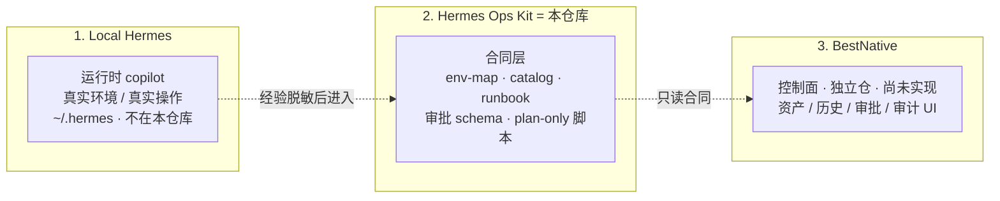
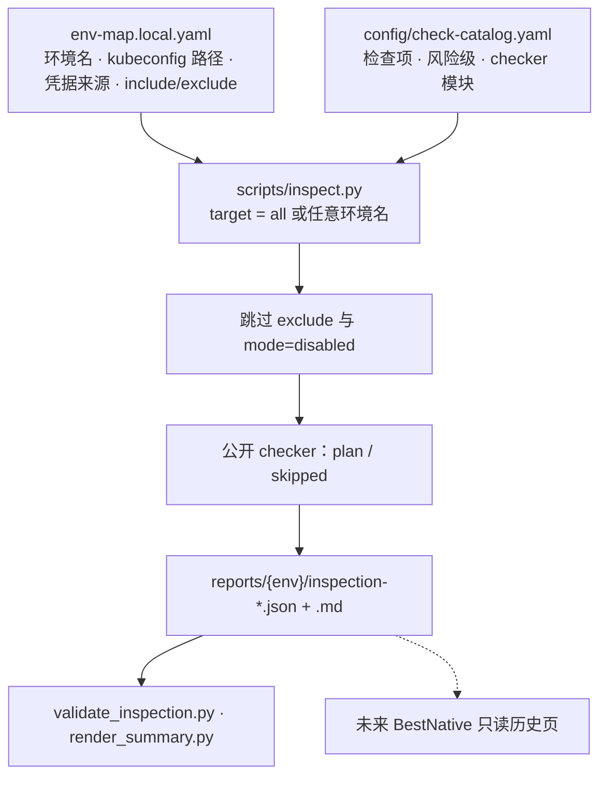
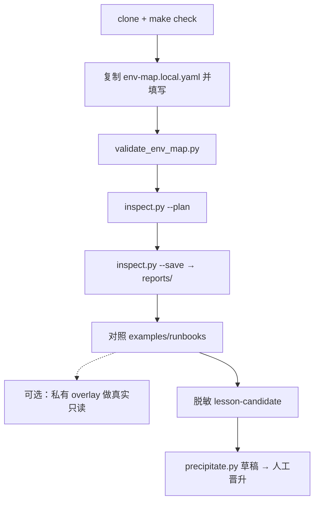

<p align="center">
  
</p>

<h1 align="center">Hermes Ops Kit</h1>

<p align="center">
  给 Hermes 用的 <b>AI SRE 工作流包</b>：先看环境、再巡检、再按清单排查，要改东西先走审批格式
</p>

<p align="center">
  <b>简体中文</b> · <a href="README.en.md">English</a>
</p>

<p align="center">
  
  
  
  
</p>

> **这是一套工作流，不是运维平台，也不是 Hermes 插件。** 干活的是你本机 Hermes（`~/.hermes`）。本仓库把那条工作流写成可重复的文件：环境地图 → 巡检报告 → 排查清单 → 审批格式。公开脚本默认 **plan-only**，不会连你的集群。

产品说明：[docs/product.md](docs/product.md)

---

## 这算什么

**一句话：** 把「用 AI 做 SRE」从临场聊天，收成一条可重复、可分享、先事实再动手的工作流。

它**是**工作流（固定步骤和出入口），**不是**工作流引擎（没有调度中心、没有定时跑生产巡检、没有网页一点就改集群）。引擎是 Hermes；本仓库是这条工作流的说明书和接头。

```text
没有 kit：打开 Hermes → 口述环境 → AI 现场编 kubectl → 聊完即丢 → 一转发就可能带秘密
有了 kit：填 env-map → inspect 出同一形状的报告 → 对上 Runbook → Hermes 按清单查 → 要变更走审批字段
```

| | 只跟 Hermes 聊 | 用这套工作流 |
|---|---|---|
| 环境事实 | 每次在对话里重讲 | 写在 `env-map.local.yaml`，可复用 |
| 巡检结果 | 聊天记录，下次形状不同 | 固定 JSON，可给以后的 UI 用 |
| 怎么排查 | AI 临场发挥 | L0 清单：先看什么、禁止直接删 |
| 分享给同事 | 几乎只能拷 `~/.hermes` 或贴日志 | 公开仓只有骨架；秘密留在本机 |
| 以后做网页 | 得重新发明报告格式 | BestNative 只读同一套合同 |

clone 之后立刻能做：`make check` → 复制 env-map → `inspect.py --plan` → 对照 `examples/runbooks/`。
clone **不会**：自动巡检生产、弹出 BestNative、让 Hermes 绕过审批去改集群。

---

## 市面上有没有同类

有「听起来像」的，没有「同一件事」。2026 年大家都会说 AI SRE、Runbook、工作流，所以只看副标题会觉得普通。差在**谁干活、数据去哪、开源的是什么**。

| 类型 | 代表 | 和本仓库 |
|---|---|---|
| 托管 AI SRE | Resolve.ai、Cleric、Traversal、Datadog Bits AI | 云端 agent 去读你的日志/集群。我们**不托管**，agent 是你自己的 Hermes |
| 事故管理 + AI | incident.io、Rootly、PagerDuty | 买的是 on-call / Slack 流程。我们不接呼叫、不做状态页 |
| 会执行的 Runbook 引擎 | Rundeck、StackStorm、Ansible | 引擎在他们那边跑命令。我们**故意不执行**；公开侧只出报告形状 |
| 检查框架 | kube-bench、InSpec | 会扫集群，但不是给 LLM 的工作流合同，也没有审批字段 |
| 本仓库 | Hermes Ops Kit | 给**已经在跑的本地 Hermes** 用的可分享骨架：地图 / 巡检 JSON / 清单 / 审批格式。秘密不出门 |

所以它不是又一个「AI 帮你修生产」的产品，而是：**你已经有私有 copilot 时，用来防止它每次临场猜命令、又能把工作流脱敏公开的那一层。**

没有 Hermes、只想要 SaaS 一点就修，去看上面那些托管产品。有 Hermes、集群不能出网、还想把经验开源而不开源 `~/.hermes`，才是这套的位置。

---

## 工作流里的四样东西

1. **环境地图**（`env-map`）
   有哪些环境、kubeconfig 在哪条路径、密码从哪种来源取（不写密码值）、这次跑哪些检查。没有 Redis 就关掉。

2. **巡检报告**（`inspect.py`）
   吐出 JSON + Markdown：哪项 ok / warning / skipped。公开模板只规划、不连集群；真查集群用你自己的私有 overlay。

3. **排查清单**（Runbook 元数据）
   例如 Pod 异常先看什么。是清单形状，不是把生产 SOP 原文开源。

4. **沉淀草稿**（`precipitate.py`）
   处理完故障后，先写一份**已经脱敏**的 lesson-candidate，脚本生成 L0 runbook 草稿。公开脚本不读 `~/.hermes`；晋升进 `examples/runbooks/` 仍要人审。

```text
env-map.local.yaml
        ↓
inspect.py --plan --save
        ↓
reports/.../inspection-*.json
        ↓
examples/runbooks/k8s-pod-abnormal-diagnostic.yaml
        ↓
交给 Hermes 当事实 → 要改生产再套审批格式
        ↓
脱敏 lesson-candidate → precipitate.py → 人工晋升回 runbook 目录
```

| 角色 | 在这条工作流里干什么 |
|---|---|
| **你** | 填本地地图，决定查什么 |
| **本仓库** | 规定步骤和文件形状，给出可跑的骨架 |
| **Hermes** | 执行这条工作流：读文件、诊断、拟命令 |
| **私有 overlay** | 可选；在你机器上做真正的只读检查 |
| **BestNative** | 以后的网页控制面；现在没有，需另开仓只读本 kit |

---

## 三层边界

必须分开，不要混进同一个仓库。

```text
Local Hermes   = 私有运维 copilot；真实 env-map 与真实操作循环（不在本仓库）
Hermes Ops Kit = 本仓库：脱敏模板、schema、脚本骨架、安全规则、示例
BestNative     = 未来 Web/API 控制面（独立代码库）：资产、巡检历史、审批、审计
```



| 层 | 职责 | 本仓库 | 不允许出现 |
|---|---|---|---|
| **Local Hermes** | 私有 copilot，真实环境和真实操作 | 不包含 | 真实 env-map、skill 全文、本机探查结果 |
| **Hermes Ops Kit** | 脱敏模板、schema、plan-only 脚本、L0 示例 | **就是这个仓库** | 真实 IP、主机名、密码值、原始日志 |
| **BestNative** | 资产、巡检历史、审批、审计的 Web/API | 独立仓，尚未实现 | 适配器实现、审批状态机代码 |

私有 overlay（真实只读 checker）属于你本机，挂在 Hermes 一侧，**不要提交回 Ops Kit**。

终局愿景（规划，非实现）：[`future-product/`](future-product/README.md)

---

## 优势

不跟托管 AI SRE 比「谁更会修生产」——那不是同一类产品。优势是这些：

1. **秘密不出门**
   集群、密码、kubeconfig 留在本机。公开仓只有骨架。托管 AI SRE 要把遥测交给云端 agent。

2. **经验能开源，copilot 不用开源**
   同事 clone 的是检查项和清单形状，不是你的 `~/.hermes`。只跟 Hermes 聊的话，分享几乎等于拷贝私有目录或贴日志。

3. **AI 必须先吃事实再说话**
   env-map + 同一形状的巡检 JSON + L0「先看什么、禁止直接删」。减少每次故障临场编 kubectl。

4. **公开侧故意不会执行**
   clone 不会误连你的生产。Rundeck 一类引擎默认就是去跑命令的；那条能力留给私有 overlay 和以后的审批。

5. **以后接网页不用推倒重来**
   BestNative 只读这套 JSON/清单。换模型、换 Hermes 版本，工作流入口还在。

6. **处理完能回流，而不是用完即死**
   脱敏 lesson-candidate → `precipitate.py` 草稿 → 人工晋升进 runbook 目录。公开仓不去刮 `~/.hermes` 聊天。

没有 Hermes、也不能接受「公开模板不连集群」，这些优势用不上。有 Hermes、集群不能出网、还想把工作流给别人用并越用越厚，这些才成立。

---

## 它怎么工作



凭据只写**来源**（`file` / `env` / `k8s_secret` / `external_secret` / `manual`），不写密码值。`.pw` 文件只是 `file` 的一种示例，不是规定。没有的中间件用 `mode: disabled`，并从 `inspection.include` 拿掉。

真实只读检查放在**私有 overlay**，不要把拓扑和凭据路径提交回来。

---

## 使用流程



逐步说明（env-map 字段、inspect 参数、和 Hermes 配合）：[docs/clone-and-run.md](docs/clone-and-run.md)

```bash
git clone <REPO_URL> hermes-ops-kit
cd hermes-ops-kit
make check
```

`make check` 只验证**本仓库**（编译、脱敏、合同、巡检骨架、单元测试），不检查本机 Hermes。

### 1. 私有 env-map

```bash
cp config/env-map.example.yaml config/env-map.local.yaml
```

编辑环境名、`kubeconfig` **路径**、凭据**来源**、`inspection.include`。没有的中间件设 `mode: disabled` 并从 include 拿掉。不要填密码或 kubeconfig 内容。此文件已被 gitignore，不要提交。

```bash
python3 scripts/validate_env_map.py config/env-map.local.yaml --expect-env test --catalog config/check-catalog.yaml
```

把 `test` 换成你 env-map 里的名字。

### 2. 跑巡检骨架

```bash
python3 scripts/inspect.py test --config config/env-map.local.yaml --catalog config/check-catalog.yaml --plan --json
python3 scripts/inspect.py test --config config/env-map.local.yaml --json --save
```

`target` 可以是 `all`，或 env-map 里的**任意环境名**。公开侧 `--plan` 只规划；`--execute-readonly` 没有私有 overlay 时仍是 skipped。`--save` 路径写在 stderr，stdout 仍是纯 JSON。

产物（不要提交）：

```text
reports/<env>/inspection-<run_id>.json
reports/<env>/inspection-<run_id>.md
```

```bash
python3 scripts/render_summary.py reports/<env>/inspection-<run_id>.json --only-abnormal
```

JSON 里 `suggestion` 会指向 runbook 名，例如 `k8s-pod-abnormal-diagnostic` → `examples/runbooks/k8s-pod-abnormal-diagnostic.yaml`。

### 3. Onboard 候选

```bash
python3 scripts/onboard.py --env test --output config/env-map.generated.yaml --force
```

公开 onboard **不扫集群**，只出草稿。人工审阅后才能合进 `env-map.local.yaml`。

### 4. 沉淀候选

故障处理完、已经脱敏之后：

```bash
python3 scripts/precipitate.py \
  --from examples/lesson-candidate.example.yaml \
  --output /tmp/example-component-health-diagnostic.generated.yaml \
  --force
```

公开 `precipitate.py` **不读** `~/.hermes`。输出是草稿，不要提交；审阅后再拷进 `examples/runbooks/`。说明：[docs/precipitation.md](docs/precipitation.md)。

### 5. 真实检查与 Hermes

真实只读检查放仓库外的**私有 overlay**：[docs/private-checker-guide.md](docs/private-checker-guide.md)。本仓库不会自动挂到 Hermes；把 `env-map.local.yaml`、runbook、`reports/*.json` 当作 Agent 的事实输入即可。BestNative 以后只读这些合同，现在没有 Web UI。

合同流：[docs/end-to-end-example.md](docs/end-to-end-example.md) · 文档目录：[docs/README.md](docs/README.md)

---

## 仓库结构

```text
hermes-ops-kit/
├── README.md / README.en.md
├── SECURITY.md / CONTRIBUTING.md / LICENSE
├── Makefile                  make check = 仓库门禁
├── config/
│   ├── env-map.example.yaml  环境地图示例（无秘密）
│   ├── check-catalog.yaml    检查项目录
│   └── schema/               env-map / inspection / runbook / lesson-candidate / approval 合同
├── scripts/                  inspect / onboard / precipitate / 校验 / 脱敏（公开默认不连真实系统）
├── examples/runbooks/        脱敏 L0 runbook 元数据
├── templates/                JSON / YAML / Markdown 模板
├── tests/                    单元测试与合同测试
├── docs/                     说明与图标（先看 docs/README.md）
├── future-product/           终局愿景（规划，非实现）
└── .github/workflows/        make check CI
```

不要提交：`config/env-map.local.yaml`、`config/env-map.generated.yaml`、`reports/`、`*.pw` / `*.key` / `.env`。

---

## 提供 / 不提供

**提供**

- env-map、check catalog、巡检 JSON 合同
- plan-only checker 与私有 overlay 说明
- L0 runbook 元数据示例（K8s / MySQL / Redis / RabbitMQ / ES / 节点 / ArgoCD / Longhorn）
- 审批/审计 schema 与请求模板
- 脱敏扫描、publish-guard、`make check`
- BestNative **只读**消费合同

**不提供**

- 密码、token、私钥、kubeconfig 内容
- 对真实集群/中间件的默认连接
- 自动高风险执行、生产 Web UI
- 替代 Prometheus / Elasticsearch / Alertmanager
- 已经打通的 BestNative 部署

---

## 安全模型

1. 真实配置只留在本地 `env-map.local.yaml`。
2. 发现输出只写 `env-map.generated.yaml`，人工确认后才能晋升。
3. L0 只读不需要审批；L2/L3 需要审批、回滚、审计合同。
4. PRD 默认只出命令，除非已有硬 RBAC、审批和审计。

详情：[SECURITY.md](SECURITY.md) · [docs/safety-model.md](docs/safety-model.md) · 上传前人工评审：[docs/public-release-review.md](docs/public-release-review.md)

可选本机 Hermes 体检（**不是**门禁，可能碰到 `~/.hermes`）：

```bash
make health-check
```

---

## BestNative

BestNative **不是这个仓库，也还没有打通**。它是未来的独立 Web/API 控制面。本仓库只提供它要读的合同。

```text
Ops Kit 产出合同  →  BestNative 只读展示/存历史  →  以后才桥接 Hermes 受控执行
```

| 现在 | 以后（BestNative 独立仓） |
|---|---|
| 本仓库定义 JSON/YAML 形状和 L0 示例 | 做成页面和 API：历史、目录、审批单 |
| `inspect.py` 在本机写 `reports/` | 读 `HERMES_OPS_KIT_PATH`，**不改 kit 源码** |
| 审批只有 schema 模板 | 有状态机之后才允许 L2/L3 |
| 没有执行 API | 有 RBAC / 审计 / 回滚后再调 Hermes |

下一步不是在本仓库里写控制面，而是**先把 BestNative 做成独立仓**，再只读本仓库。联动步骤：[docs/bestnative-integration.md](docs/bestnative-integration.md)

- [docs/product.md](docs/product.md) — 职责切分
- [docs/bestnative-contract.md](docs/bestnative-contract.md) — 可读文件与巡检 JSON 字段
- [docs/bestnative-integration.md](docs/bestnative-integration.md) — 只读 → 审批 → 受控执行

---

## 路线图

| 阶段 | 内容 |
|---|---|
| `v0.3-prep` | GitHub 门禁、BestNative 只读合同草案 |
| `v0.4-preview`（当前） | env-map + catalog 巡检框架；公开 checker plan-only；L0 runbook 示例齐 |
| `v0.5` | 按 [public-release-review.md](docs/public-release-review.md) 做公开发布人工评审 |
| `v1.0` | BestNative 只读控制面（**独立仓库**）消费本仓库合同 |

阶段计划：[docs/implementation-roadmap.md](docs/implementation-roadmap.md) · 成熟度：[docs/project-status.md](docs/project-status.md)

---

## 贡献

见 [CONTRIBUTING.md](CONTRIBUTING.md)。不要提交真实 IP、主机名、凭据或原始故障日志。

## 许可

MIT
