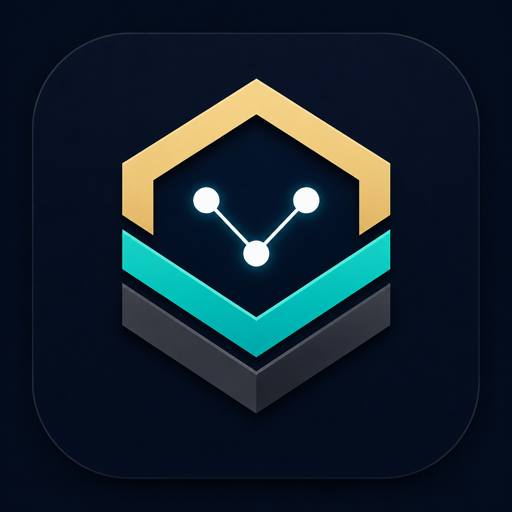
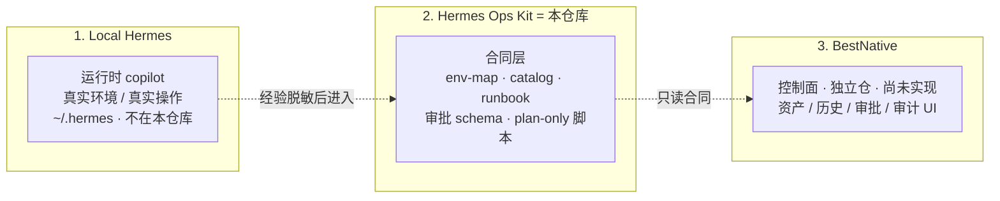
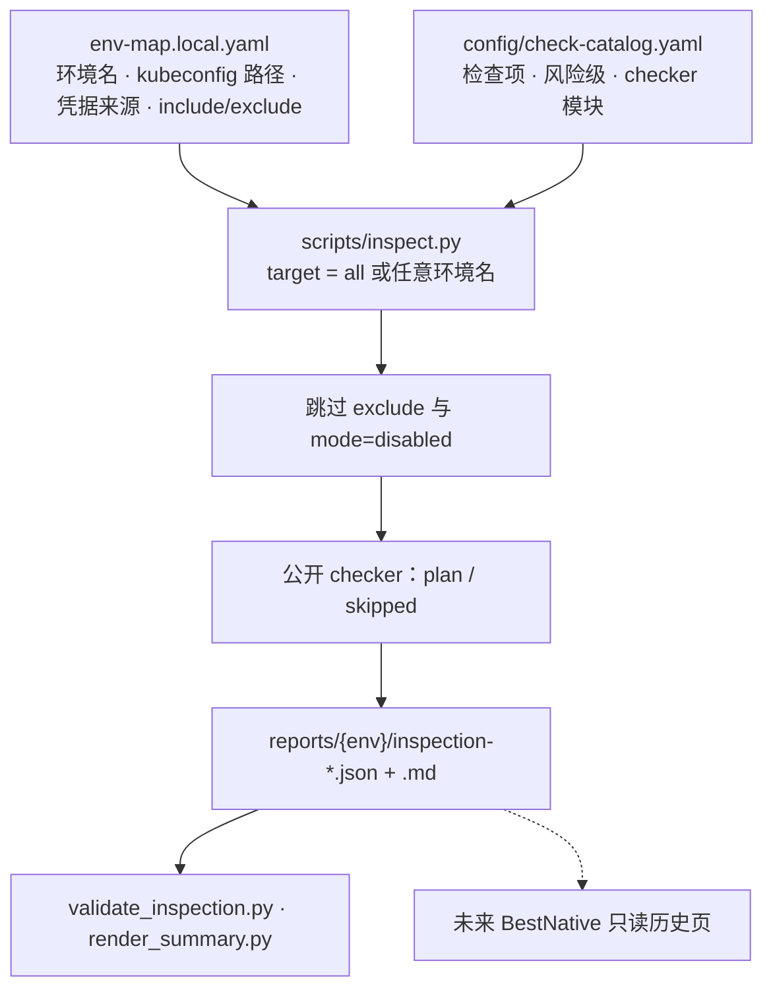
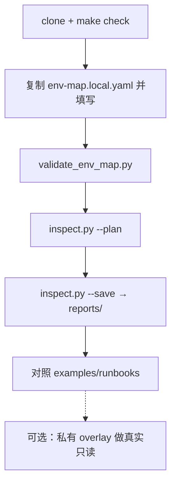

<p align="center">
  
</p>

<h1 align="center">Hermes Ops Kit</h1>

<p align="center">
  给 Hermes Agent 用的本地优先 AI SRE <b>契约与 Runbook 模板包</b>
</p>

<p align="center">
  <b>简体中文</b> · <a href="README.en.md">English</a>
</p>

<p align="center">
  
  
  
  
</p>

> **不是 Hermes 的功能分支，也不是 fork。** Hermes 仍是你本机的运行时 copilot（`~/.hermes`）。本仓库是独立合同层，给 Agent 和未来的 BestNative 读。公开脚本默认 **plan-only**：不连接 Kubernetes、SSH、数据库或外部服务。

产品说明 · [docs/product.md](docs/product.md)　·　语言切换页（浏览器打开）· [docs/index.html](docs/index.html)

---

## 定位

| 它是 | 它不是 |
|---|---|
| 可脱敏发布的巡检 / Runbook / 审批**合同** | Hermes Agent 源码或 `~/.hermes` 备份 |
| 给 AI 的稳定事实层（环境地图 + 检查目录） | 临场猜命令的 chatbot |
| 公开 plan-only 骨架 + 私有 overlay 接口 | clone 后立刻巡检生产集群的工具 |
| 未来控制面的只读数据源 | 已经上线的 BestNative / 运维 SaaS |

---

## 三层边界

必须分开，不要混进同一个仓库。

```text
Local Hermes   = 私有运维 copilot；真实 env-map 与真实操作循环（不在本仓库）
Hermes Ops Kit = 本仓库：脱敏模板、schema、脚本骨架、安全规则、示例
BestNative     = 未来 Web/API 控制面（独立代码库）：资产、巡检历史、审批、审计
```



| 层 | 职责 | 本仓库 | 不允许出现 |
|---|---|---|---|
| **Local Hermes** | 私有 copilot，真实环境和真实操作 | 不包含 | 真实 env-map、skill 全文、本机探查结果 |
| **Hermes Ops Kit** | 脱敏模板、schema、plan-only 脚本、L0 示例 | **就是这个仓库** | 真实 IP、主机名、密码值、原始日志 |
| **BestNative** | 资产、巡检历史、审批、审计的 Web/API | 独立仓，尚未实现 | 适配器实现、审批状态机代码 |

私有 overlay（真实只读 checker）属于你本机，挂在 Hermes 一侧，**不要提交回 Ops Kit**。

终局愿景（规划，非实现）：[`future-product/`](future-product/README.md)

---

## 能力与优势

**现在能做**

- 用 env-map 描述环境、凭据**来源**（不是密码值）和要跑哪些检查
- 按 catalog 分发巡检，输出稳定的 JSON / Markdown（公开侧只规划，不连集群）
- L0 Runbook 元数据：K8s / MySQL / Redis / RabbitMQ / ES / 节点 / ArgoCD / Longhorn
- 审批与审计的 schema 模板（字段合同，不是审批中心产品）
- `make check`：编译、脱敏、合同校验、单元测试

**为什么这样拆**

- **本地优先**：秘密和拓扑留在本机，GitHub 只有骨架
- **先事实、后推理**：减少 AI 幻觉命令
- **和运行时解耦**：合同不绑死在 Hermes 源码或某次模型升级里
- **可裁剪**：没有的中间件 `mode: disabled`；凭据不规定必须用 `.pw`
- **可接控制面**：BestNative 不用再发明一套巡检 JSON

---

## 它怎么工作



凭据只写**来源**（`file` / `env` / `k8s_secret` / `external_secret` / `manual`），不写密码值。`.pw` 文件只是 `file` 的一种示例，不是规定。没有的中间件用 `mode: disabled`，并从 `inspection.include` 拿掉。

真实只读检查放在**私有 overlay**，不要把拓扑和凭据路径提交回来。

---

## 使用流程



逐步说明（env-map 字段、inspect 参数、和 Hermes 配合）：[docs/clone-and-run.md](docs/clone-and-run.md)

```bash
git clone <REPO_URL> hermes-ops-kit
cd hermes-ops-kit
make check
```

`make check` 只验证**本仓库**（编译、脱敏、合同、巡检骨架、单元测试），不检查本机 Hermes。

### 1. 私有 env-map

```bash
cp config/env-map.example.yaml config/env-map.local.yaml
```

编辑环境名、`kubeconfig` **路径**、凭据**来源**、`inspection.include`。没有的中间件设 `mode: disabled` 并从 include 拿掉。不要填密码或 kubeconfig 内容。此文件已被 gitignore，不要提交。

```bash
python3 scripts/validate_env_map.py config/env-map.local.yaml --expect-env test --catalog config/check-catalog.yaml
```

把 `test` 换成你 env-map 里的名字。

### 2. 跑巡检骨架

```bash
python3 scripts/inspect.py test --config config/env-map.local.yaml --catalog config/check-catalog.yaml --plan --json
python3 scripts/inspect.py test --config config/env-map.local.yaml --json --save
```

`target` 可以是 `all`，或 env-map 里的**任意环境名**。公开侧 `--plan` 只规划；`--execute-readonly` 没有私有 overlay 时仍是 skipped。`--save` 路径写在 stderr，stdout 仍是纯 JSON。

产物（不要提交）：

```text
reports/<env>/inspection-<run_id>.json
reports/<env>/inspection-<run_id>.md
```

```bash
python3 scripts/render_summary.py reports/<env>/inspection-<run_id>.json --only-abnormal
```

JSON 里 `suggestion` 会指向 runbook 名，例如 `k8s-pod-abnormal-diagnostic` → `examples/runbooks/k8s-pod-abnormal-diagnostic.yaml`。

### 3. Onboard 候选

```bash
python3 scripts/onboard.py --env test --output config/env-map.generated.yaml --force
```

公开 onboard **不扫集群**，只出草稿。人工审阅后才能合进 `env-map.local.yaml`。

### 4. 真实检查与 Hermes

真实只读检查放仓库外的**私有 overlay**：[docs/private-checker-guide.md](docs/private-checker-guide.md)。本仓库不会自动挂到 Hermes；把 `env-map.local.yaml`、runbook、`reports/*.json` 当作 Agent 的事实输入即可。BestNative 以后只读这些合同，现在没有 Web UI。

合同流：[docs/end-to-end-example.md](docs/end-to-end-example.md) · 文档目录：[docs/README.md](docs/README.md)

---

## 仓库结构

```text
hermes-ops-kit/
├── README.md / README.en.md
├── SECURITY.md / CONTRIBUTING.md / LICENSE
├── Makefile                  make check = 仓库门禁
├── config/
│   ├── env-map.example.yaml  环境地图示例（无秘密）
│   ├── check-catalog.yaml    检查项目录
│   └── schema/               env-map / inspection / runbook / approval 合同
├── scripts/                  inspect / onboard / 校验 / 脱敏（公开默认不连真实系统）
├── examples/runbooks/        脱敏 L0 runbook 元数据
├── templates/                JSON / YAML / Markdown 模板
├── tests/                    单元测试与合同测试
├── docs/                     说明与图标（先看 docs/README.md）
├── future-product/           终局愿景（规划，非实现）
└── .github/workflows/        make check CI
```

不要提交：`config/env-map.local.yaml`、`config/env-map.generated.yaml`、`reports/`、`*.pw` / `*.key` / `.env`。

---

## 提供 / 不提供

**提供**

- env-map、check catalog、巡检 JSON 合同
- plan-only checker 与私有 overlay 说明
- L0 runbook 元数据示例（K8s / MySQL / Redis / RabbitMQ / ES / 节点 / ArgoCD / Longhorn）
- 审批/审计 schema 与请求模板
- 脱敏扫描、publish-guard、`make check`
- BestNative **只读**消费合同

**不提供**

- 密码、token、私钥、kubeconfig 内容
- 对真实集群/中间件的默认连接
- 自动高风险执行、生产 Web UI
- 替代 Prometheus / Elasticsearch / Alertmanager
- 已经打通的 BestNative 部署

---

## 安全模型

1. 真实配置只留在本地 `env-map.local.yaml`。
2. 发现输出只写 `env-map.generated.yaml`，人工确认后才能晋升。
3. L0 只读不需要审批；L2/L3 需要审批、回滚、审计合同。
4. PRD 默认只出命令，除非已有硬 RBAC、审批和审计。

详情：[SECURITY.md](SECURITY.md) · [docs/safety-model.md](docs/safety-model.md) · 上传前人工评审：[docs/public-release-review.md](docs/public-release-review.md)

可选本机 Hermes 体检（**不是**门禁，可能碰到 `~/.hermes`）：

```bash
make health-check
```

---

## BestNative

BestNative **不是这个仓库，也还没有打通**。它是未来的独立 Web/API 控制面。本仓库只提供它要读的合同。

```text
Ops Kit 产出合同  →  BestNative 只读展示/存历史  →  以后才桥接 Hermes 受控执行
```

| 现在 | 以后（BestNative 独立仓） |
|---|---|
| 本仓库定义 JSON/YAML 形状和 L0 示例 | 做成页面和 API：历史、目录、审批单 |
| `inspect.py` 在本机写 `reports/` | 读 `HERMES_OPS_KIT_PATH`，**不改 kit 源码** |
| 审批只有 schema 模板 | 有状态机之后才允许 L2/L3 |
| 没有执行 API | 有 RBAC / 审计 / 回滚后再调 Hermes |

下一步不是在本仓库里写控制面，而是**先把 BestNative 做成独立仓**，再只读本仓库。联动步骤：[docs/bestnative-integration.md](docs/bestnative-integration.md)

- [docs/product.md](docs/product.md) — 职责切分
- [docs/bestnative-contract.md](docs/bestnative-contract.md) — 可读文件与巡检 JSON 字段
- [docs/bestnative-integration.md](docs/bestnative-integration.md) — 只读 → 审批 → 受控执行

---

## 路线图

| 阶段 | 内容 |
|---|---|
| `v0.3-prep` | GitHub 门禁、BestNative 只读合同草案 |
| `v0.4-preview`（当前） | env-map + catalog 巡检框架；公开 checker plan-only；L0 runbook 示例齐 |
| `v0.5` | 按 [public-release-review.md](docs/public-release-review.md) 做公开发布人工评审 |
| `v1.0` | BestNative 只读控制面（**独立仓库**）消费本仓库合同 |

阶段计划：[docs/implementation-roadmap.md](docs/implementation-roadmap.md) · 成熟度：[docs/project-status.md](docs/project-status.md)

---

## 贡献

见 [CONTRIBUTING.md](CONTRIBUTING.md)。不要提交真实 IP、主机名、凭据或原始故障日志。

## 许可

MIT
