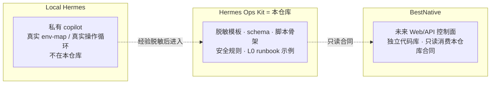
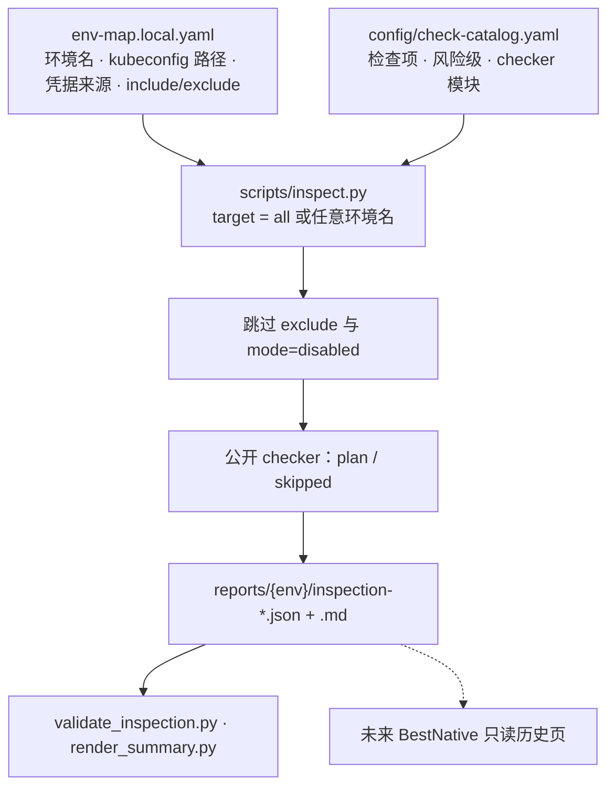

# Hermes Ops Kit

当前阶段 Current stage: **`v0.4-preview`**

面向 Hermes Agent 的本地优先 AI SRE Runbook **模板/契约包**。
A local-first AI SRE Runbook **template and contract kit** for Hermes Agent.

它把巡检、Runbook、审批、审计和安全规则抽成可脱敏发布的骨架。它**不是**在线运维平台、**不是**真实环境备份、**不是**正在运行的 copilot、**也不是** BestNative。
It extracts inspection, runbooks, approval, audit, and safety rules into reusable, sanitized templates. It is **not** an online ops platform, **not** a backup of a real environment, **not** a running copilot, and **not** BestNative.

公开脚本默认 **plan-only**：不连接 Kubernetes、SSH、数据库或外部服务。
Public scripts are **plan-only** by default: they do not connect to Kubernetes, SSH, databases, or external services.

---

## 三层边界 / Three layers



| 层 Layer | 职责 Role | 本仓库 This repo |
|---|---|---|
| **Local Hermes** | 私有运维 copilot，真实环境和真实操作 | 不包含 / not included |
| **Hermes Ops Kit** | 脱敏模板、schema、plan-only 脚本、示例 | **就是这个仓库** / **this repository** |
| **BestNative** | 资产、巡检历史、审批、审计的 Web/API | 独立仓，尚未实现 / separate repo, not started |

终局愿景（规划，非实现）见 [`future-product/`](future-product/README.md)。
End-state vision (planning only): [`future-product/`](future-product/README.md).

---

## 它怎么工作 / How it works



凭据只写**来源**（`file` / `env` / `k8s_secret` / `external_secret` / `manual`），不写密码值。`.pw` 文件只是 `file` 的一种示例，不是规定。没有的中间件用 `mode: disabled`，并从 `inspection.include` 拿掉。
Credentials are **sources** only (`file` / `env` / `k8s_secret` / `external_secret` / `manual`), never values. A `.pw` file is one `file` example, not a requirement. Unused middleware: `mode: disabled`, and omit it from `inspection.include`.

真实只读检查放在**私有 overlay**，不要把拓扑和凭据路径提交回来。
Real read-only checks live in a **private overlay**. Do not commit topology or credential paths.

---

## 克隆与运行 / Clone and run

```bash
git clone <REPO_URL> hermes-ops-kit
cd hermes-ops-kit
make check
```

`make check` 只验证**本仓库**（编译、脱敏、env-map/catalog/runbook 合同、巡检骨架、单元测试）。它不检查本机 Hermes。
`make check` validates **this repository** only. It does not inspect a running local Hermes.

### 1. 私有 env-map / Private env-map

```bash
cp config/env-map.example.yaml config/env-map.local.yaml
```

只填路径、别名、凭据来源。不要填密码、token、kubeconfig 内容。此文件已被 `.gitignore` 忽略，不要提交。
Fill paths, aliases, and credential sources only. Do not put passwords, tokens, or kubeconfig contents. The file is gitignored — do not commit it.

### 2. 跑巡检骨架 / Run the inspection skeleton

```bash
python3 scripts/validate_env_map.py config/env-map.local.yaml --expect-env test --catalog config/check-catalog.yaml
python3 scripts/inspect.py test --config config/env-map.local.yaml --catalog config/check-catalog.yaml --plan --json
python3 scripts/inspect.py test --config config/env-map.local.yaml --json --save
```

`target` 可以是 `all`，或 env-map 里的**任意环境名**（不限于 `dev` / `test` / `prd`）。
`target` may be `all`, or **any environment name** in the env-map (not only `dev` / `test` / `prd`).

`--plan`：只规划，不执行。`--execute-readonly`：公开 checker 仍然 skipped，除非私有 overlay 注入 runner。
`--plan` plans only. `--execute-readonly` still skips in the public tree unless a private overlay injects a runner.

预期产物 Expected output:

```text
reports/<env>/inspection-<run_id>.json
reports/<env>/inspection-<run_id>.md
```

`reports/` 是本地产物，不要提交。
`reports/` is local output. Do not commit it.

### 3. Onboard 候选 / Onboarding candidate

```bash
python3 scripts/onboard.py --env test --output config/env-map.generated.yaml --force
```

生成文件只是候选，人工审阅后才能晋升为 `env-map.local.yaml`。
The generated file is a candidate only. Review it before promoting anything into `env-map.local.yaml`.

更完整的步骤：[docs/clone-and-run.md](docs/clone-and-run.md) · 合同流：[docs/end-to-end-example.md](docs/end-to-end-example.md) · 文档目录：[docs/README.md](docs/README.md)

---

## 仓库结构 / Repository layout

```text
hermes-ops-kit/
├── README.md                 本页 / this page
├── SECURITY.md / CONTRIBUTING.md / LICENSE
├── Makefile                  make check = 仓库门禁 / repository gate
├── config/
│   ├── env-map.example.yaml  环境地图示例（无秘密）
│   ├── check-catalog.yaml    检查项目录
│   └── schema/               env-map / inspection / runbook / approval 合同
├── scripts/
│   ├── inspect.py            巡检分发（plan-only）
│   ├── onboard.py            生成 env-map 候选
│   ├── validate_*.py         env-map / inspection / runbook 校验
│   ├── sanitize_check.py     脱敏扫描
│   ├── checkers/             插件；公开侧 skipped，测试可注入 runner
│   └── lib/                  env-map / catalog 加载器
├── examples/runbooks/        脱敏 L0 runbook 元数据
├── templates/                JSON / YAML / Markdown 模板
├── tests/                    单元测试与合同测试
├── docs/                     说明（先看 docs/README.md）
├── future-product/           终局愿景（规划，非实现）
└── .github/workflows/        make check CI
```

不要提交 Do not commit: `config/env-map.local.yaml`、`config/env-map.generated.yaml`、`reports/`、`*.pw` / `*.key` / `.env`。

---

## 本仓库提供 / 不提供

**提供 Provides**

- env-map、check catalog、巡检 JSON 合同
- plan-only checker 与私有 overlay 说明
- L0 runbook 元数据示例（K8s / MySQL / Redis / RabbitMQ / ES / 节点 / ArgoCD / Longhorn）
- 审批/审计 schema 与请求模板
- 脱敏扫描、publish-guard、`make check`
- BestNative **只读**消费合同

**不提供 Does not provide**

- 密码、token、私钥、kubeconfig 内容
- 对真实集群/中间件的默认连接
- 自动高风险执行、生产 Web UI
- 替代 Prometheus / Elasticsearch / Alertmanager
- 已经打通的 BestNative 部署

---

## 安全模型 / Safety model

1. 真实配置只留在本地 `env-map.local.yaml`。
2. 发现输出只写 `env-map.generated.yaml`，人工确认后才能晋升。
3. L0 只读不需要审批；L2/L3 需要审批、回滚、审计合同。
4. PRD 默认只出命令，除非已有硬 RBAC、审批和审计。

详情：[SECURITY.md](SECURITY.md) · [docs/safety-model.md](docs/safety-model.md) · 上传前人工评审：[docs/public-release-review.md](docs/public-release-review.md)

可选本机 Hermes 体检（**不是**门禁，可能碰到 `~/.hermes`）：

```bash
make health-check
```

---

## BestNative

BestNative 应把本仓库当合同提供者 **只读消费**（例如 `HERMES_OPS_KIT_PATH`），不要改 kit 源码，一期不要做执行 API。
BestNative should **read** this repo as a contract provider (for example `HERMES_OPS_KIT_PATH`). It must not mutate kit sources, and Phase 1 must not add execution APIs.

- [docs/bestnative-contract.md](docs/bestnative-contract.md) — 可读哪些文件、巡检 JSON 最低字段
- [docs/bestnative-integration.md](docs/bestnative-integration.md) — 只读 → 审批 → 受控执行
- [future-product/merge-readiness.md](future-product/merge-readiness.md) — 合仓前条件；现在应保持独立仓

---

## 路线图 / Roadmap

| 阶段 Stage | 内容 What |
|---|---|
| `v0.3-prep` | GitHub 门禁、BestNative 只读合同草案 |
| `v0.4-preview`（当前 current） | env-map + catalog 巡检框架；公开 checker plan-only；L0 runbook 示例齐 |
| `v0.5` | 按 [public-release-review.md](docs/public-release-review.md) 做公开发布人工评审 |
| `v1.0` | BestNative 只读控制面（**独立仓库**）消费本仓库合同 |

阶段计划：[docs/implementation-roadmap.md](docs/implementation-roadmap.md) · 成熟度：[docs/project-status.md](docs/project-status.md)

---

## 贡献 / Contributing

见 [CONTRIBUTING.md](CONTRIBUTING.md)。不要提交真实 IP、主机名、凭据或原始故障日志。
See [CONTRIBUTING.md](CONTRIBUTING.md). Do not commit real IPs, hostnames, credentials, or raw incident logs.

## 许可 / License

MIT
