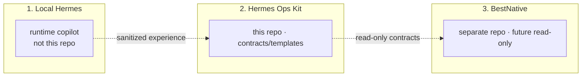
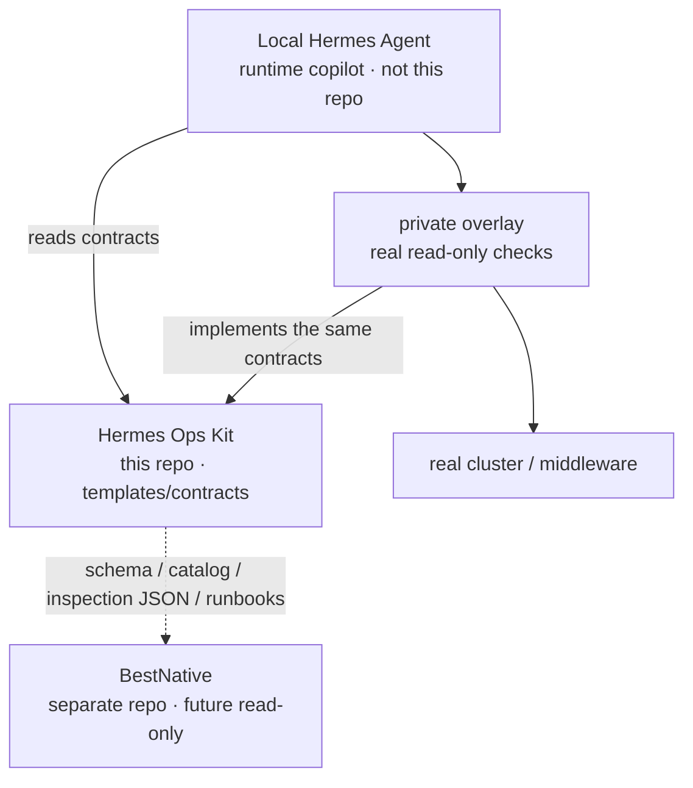
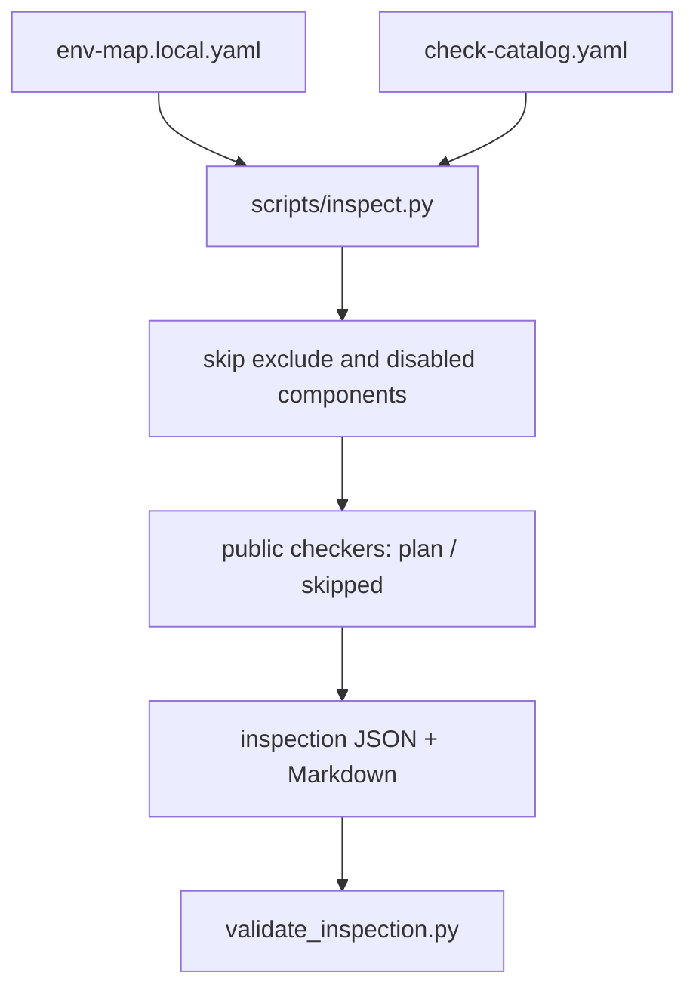

<p align="right">
  <a href="architecture.md">简体中文</a> · <b>English</b>
</p>

# Architecture

This repository is a **contract layer beside Hermes**, not a Hermes feature branch and not BestNative.

Product: [product.en.md](product.en.md).

## Three layers

Keep separate:

```text
Local Hermes   = private copilot; real env-map and real actions (not this repo)
Hermes Ops Kit = this repo: sanitized templates, schemas, plan-only scripts
BestNative     = separate control plane: assets, history, approval, audit (not built)
```



A private overlay for real checks stays next to Hermes; do not commit it here.



This repository does not run a live agent against real infrastructure. The public side does not connect to Kubernetes, SSH, or databases. `--execute-readonly` stays skipped without a private overlay.

## Inspection path now



## Core layers

- **env-map**: environment facts and credential sources (paths/aliases, never values)
- **check catalog**: checks, risk level, checker module
- **scripts**: dispatch, validate, sanitize, onboard candidate
- **runbook metadata**: read-only diagnostic procedure contract
- **docs / future-product**: docs and end-state planning

## Roadmap

1. v0.1: local templates, manual trigger
2. v0.2: schema contract + inspection JSON/Markdown skeleton
3. v0.3-prep: GitHub gates, BestNative read-only contract
4. **v0.4-preview (current)**: env-map + catalog read-only inspection framework
5. v0.5: public-release human review via [public-release-review.md](public-release-review.md)
6. v1.0: BestNative read-only control plane (separate codebase)

Details: [implementation-roadmap.md](implementation-roadmap.md). Vision: [../future-product/](../future-product/README.md) — planning only.
