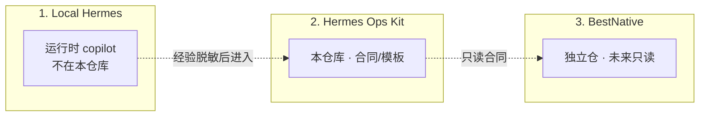
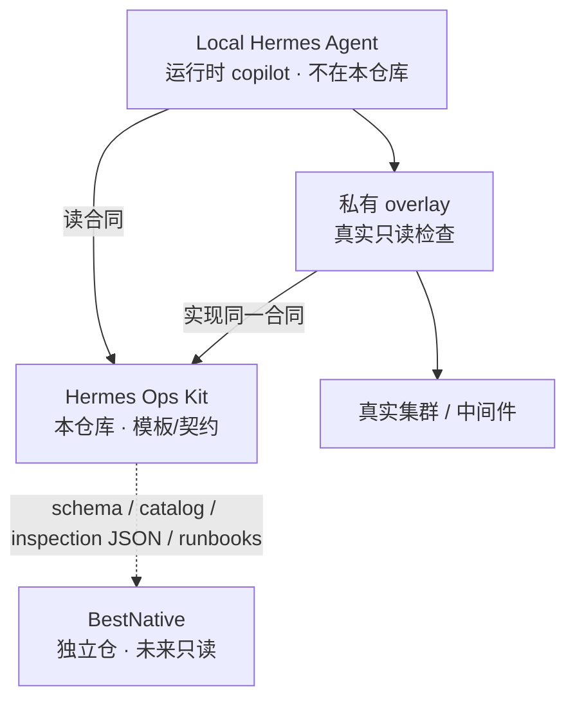
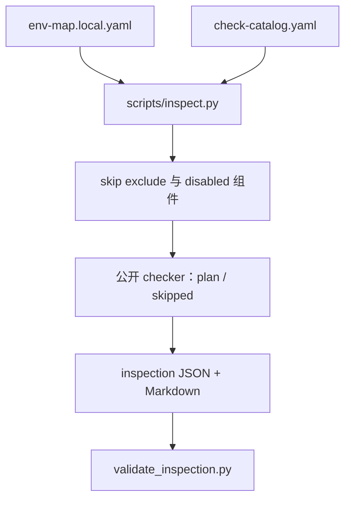

<p align="right">
  <b>简体中文</b> · <a href="architecture.en.md">English</a>
</p>

# 架构

本仓库是 **Hermes 旁边的合同层**，不是 Hermes 的功能分支，也不是 BestNative。

产品定位见 [product.md](product.md)。

## 三层边界

必须分开：

```text
Local Hermes   = 私有 copilot；真实 env-map 与真实操作（不在本仓库）
Hermes Ops Kit = 本仓库：脱敏模板、schema、plan-only 脚本
BestNative     = 独立控制面：资产、历史、审批、审计（尚未实现）
```



私有 overlay（真实只读检查）挂在 Hermes 一侧，不要提交回本仓库。



本仓库不在真实集群上跑一套在线 Agent。公开侧不连 Kubernetes / SSH / DB。

## 当前巡检链路



`--execute-readonly` 没有私有 overlay 时仍是 skipped。

## 核心层

- **env-map**：环境事实和凭据来源（路径/别名，不含凭据值）
- **check catalog**：检查项、风险级、对应 checker
- **scripts**：巡检分发、校验、脱敏、onboard 候选
- **runbook metadata**：只读诊断规程合同
- **docs / future-product**：接入说明与终局规划

## 演进路线

1. v0.1：本地模板，手动触发
2. v0.2：schema 合同 + 巡检 JSON/Markdown 骨架
3. v0.3-prep：GitHub 门禁、BestNative 只读合同
4. **v0.4-preview（当前）**：env-map + catalog 驱动的只读巡检框架
5. v0.5：按 [public-release-review.md](public-release-review.md) 做公开发布人工评审
6. v1.0：BestNative 只读控制面消费本仓库合同（独立代码库）

详细阶段见 [implementation-roadmap.md](implementation-roadmap.md)。终局愿景见 [../future-product/](../future-product/README.md)，不是当前实现。
