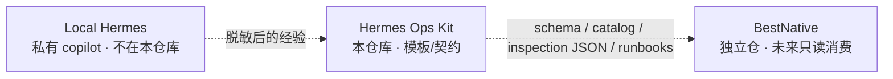
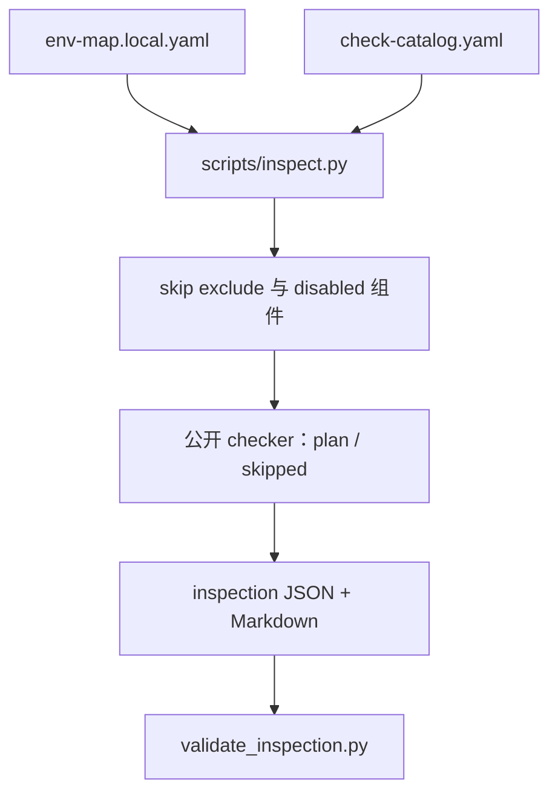

# 架构 / Architecture

本仓库只做中间层：脱敏模板和合同。它不在真实集群上跑一套在线 Agent，也不是 BestNative。
This repository is only the middle layer: sanitized templates and contracts. It does not run a live agent against real infrastructure, and it is not BestNative.

## 当前巡检链路 / Inspection path now

公开侧不连 Kubernetes / SSH / DB。`--execute-readonly` 没有私有 overlay 时仍是 skipped。
The public side does not connect to Kubernetes, SSH, or databases. `--execute-readonly` stays skipped without a private overlay.

## 核心层 / Core layers

- **env-map**：环境事实和凭据来源（路径/别名，不含凭据值） / environment facts and credential sources (paths/aliases, never values)
- **check catalog**：检查项、风险级、对应 checker / checks, risk level, checker module
- **scripts**：巡检分发、校验、脱敏、onboard 候选 / dispatch, validate, sanitize, onboard candidate
- **runbook metadata**：只读诊断规程合同 / read-only diagnostic procedure contract
- **docs / future-product**：接入说明与终局规划 / docs and end-state planning

## 演进路线 / Roadmap

1. v0.1：本地模板，手动触发 / local templates, manual trigger
2. v0.2：schema 合同 + 巡检 JSON/Markdown 骨架 / schema contract + inspection skeleton
3. v0.3-prep：GitHub 门禁、BestNative 只读合同 / GitHub-ready gates, read-only contract
4. **v0.4-preview（当前 current）**：env-map + catalog 驱动的只读巡检框架 / env-map + catalog read-only inspection framework
5. v0.5：按 [public-release-review.md](public-release-review.md) 做公开发布人工评审 / public-release human review
6. v1.0：BestNative 只读控制面消费本仓库合同（独立代码库） / BestNative read-only control plane (separate codebase)

详细阶段见 [implementation-roadmap.md](implementation-roadmap.md)。终局愿景见 [../future-product/](../future-product/README.md)，不是当前实现。
Details: [implementation-roadmap.md](implementation-roadmap.md). End-state vision: [../future-product/](../future-product/README.md) — planning only.
