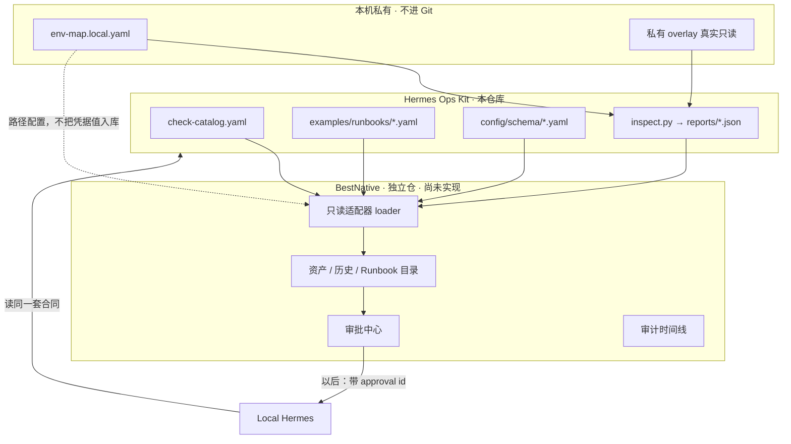

# 后续怎么接 BestNative / How BestNative will connect

**先把 BestNative 做成独立仓库，再在那边读本仓库。不要在 Ops Kit 里写适配器或审批状态机。**
**Build BestNative as a separate repository first, then have it read this kit. Do not put the adapter or approval state machine in Ops Kit.**

当前 kit（`v0.4-preview`）已经提供合同。缺的是 BestNative 产品本身：页面、API、数据库、RBAC。
This kit already provides the contracts. What is missing is the BestNative product: UI, API, database, RBAC.

```text
现在：Hermes 本机 + Ops Kit 合同
下一步：新建 BestNative 仓，一期只读
再往后：BestNative 审批/审计
最后：审批通过后再桥接 Hermes 执行
```

---

## 谁先谁后 / Sequencing

| 顺序 Order | 在哪做 Where | 做什么 What |
|---|---|---|
| 1（当前） | **本仓库 Ops Kit** | 合同稳定：catalog、inspection JSON、runbook、approval schema |
| 2（下一步） | **BestNative 新仓** | 最小控制面：能跑起来的 Web/API，**还不要执行** |
| 3 | BestNative 仓 | 适配器：`HERMES_OPS_KIT_PATH` 只读加载 kit |
| 4 | BestNative 仓 | 审批队列 + 审计库 |
| 5 | BestNative 仓 + 本机 Hermes | 有 approval id 才允许受控执行 |

合仓（submodule / monorepo）排在最后，条件见 [../future-product/merge-readiness.md](../future-product/merge-readiness.md)。早期用独立仓 + 本地路径最安全。
Do not merge repositories until merge-readiness passes. Separate repos plus a local path is safest early on.

---

## 怎么联动 / How they work together



运行时约定 Runtime convention:

```text
HERMES_OPS_KIT_PATH=/path/to/hermes-ops-kit
HERMES_OPS_REPORTS_DIR=/path/to/reports          # 或 kit 旁的 reports/
HERMES_OPS_ENV_MAP=/path/to/env-map.local.yaml   # 仅本机；BestNative 不上传密码
```

BestNative **只读**这些文件，不改 kit 源码，不把 schema fork 一份自己演化（跟 `schema_version`）。
BestNative **reads** these files. It must not mutate kit sources or fork schemas.

可读文件清单：[bestnative-contract.md](bestnative-contract.md)。

---

## BestNative 一期（只读）/ Phase 1

在 **BestNative 仓库**实现，不在本仓库：

1. 配置 `HERMES_OPS_KIT_PATH`，路径无效时给出明确错误。
2. 加载：
   - `config/check-catalog.yaml` → 检查项目录页
   - `examples/runbooks/*.yaml` → Runbook 目录（不要只读那个空 template）
   - `reports/<env>/inspection-*.json` → 巡检历史
   - schema 文件 → 合同状态页
3. API 建议（名称可改，语义不要改成执行）：
   - `GET /api/ops-kit/status`
   - `GET /api/ops-kit/inspection-runs`
   - `GET /api/ops-kit/runbooks`
   - `GET /api/ops-kit/schemas`
4. **没有** `POST /execute`、没有 Web kubectl、没有把密码写入 BestNative DB。

验收：打开 BestNative 能看到 kit 的 catalog / runbook / 本地历史；关掉 kit 路径会失败而不是静默编造数据。

---

## 二期、三期 / Phase 2 and 3

**二期（仍在 BestNative 仓）**：按 `config/schema/approval.schema.yaml` 做审批单和审计表。没有 approval id，不能进入 L2/L3。`commands_hash` 变了则审批作废。

**三期**：RBAC、命令哈希、回滚计划齐了，BestNative 再把「已批准的计划」交给本机 Hermes 执行。执行结果写回 `operation_audit`。PRD 默认仍只出命令。

不要颠倒：没有审批中心就不要做执行桥。
Do not invert this: no execution bridge before an approval center exists.

---

## 本仓库不再加什么 / What Ops Kit will not add

- BestNative 前端/后端代码
- `backend/app/integrations/hermes_ops_kit/`
- 审批状态机实现
- 把 BestNative 当 git submodule 塞进本仓库

kit 侧后续只维护合同：schema、catalog、示例、`make check`。联动代码属于 BestNative。
This kit only keeps maintaining contracts. Linkage code belongs in BestNative.

阶段拆解（含建议的 API 路径）：[implementation-roadmap.md](implementation-roadmap.md) Phase 3–5。
Phase breakdown: [implementation-roadmap.md](implementation-roadmap.md) Phases 3–5.

## 禁止 / Anti-goals

- 危险的 Web kubectl
- 凭据值进 BestNative 数据库
- 自动把 discovery 晋升为正式 env-map
- 在 kit 里「顺便」实现控制面
