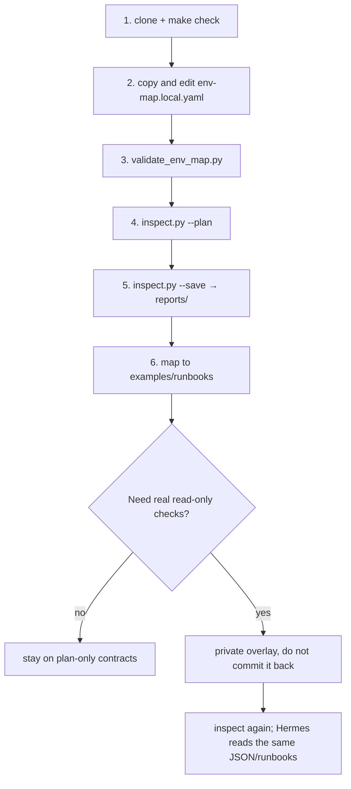

<p align="right">
  <a href="clone-and-run.md">简体中文</a> · <b>English</b>
</p>

# How to use

Follow this path after cloning. The public template does **not** connect to real Kubernetes, SSH, or databases.



Shorter summary: [../README.en.md](../README.en.md). Contract walkthrough: [end-to-end-example.en.md](end-to-end-example.en.md).

---

## 0. Prerequisites

- `git`, `python3` (3.11+), `make`
- No cluster, kubeconfig contents, or database needed for the first-time path below
- Optional: Hermes Agent locally (only for `make health-check` or feeding contracts to the agent)

```bash
git clone <REPO_URL> hermes-ops-kit
cd hermes-ops-kit
```

---

## First time: public template

### 1. Repository gate

```bash
make check
```

This validates **this repository** only: compile, sanitize, env-map/catalog/runbook contracts, inspection skeleton, unit tests. It does **not** inspect local Hermes. Optional template (may touch `~/.hermes`):

```bash
make health-check
```

### 2. Private env-map

```bash
cp config/env-map.example.yaml config/env-map.local.yaml
```

The file is gitignored. **Do not commit it.** Paths, aliases, and credential **sources** only — never passwords, tokens, or kubeconfig contents.

| Field | How to fill |
|---|---|
| `environments.<name>` | Any name: `dev` / `test` / `staging` / `prd` |
| `kubeconfig` | Local path such as `~/.kube/config-test`; do not paste file contents |
| `credentials.*.type` | `file` / `env` / `k8s_secret` / `external_secret` / `manual` |
| `credentials.*.path` or `variable` or `secret` | Source locator; `.pw` is one `file` example |
| `components.<name>.mode` | `auto` / `manual` / **`disabled`** |
| `inspection.include` | Check ids that exist in `config/check-catalog.yaml` |
| `inspection.exclude` | Ids to skip |

No Redis / Longhorn: set `mode: disabled` and drop `redis_health` / `longhorn_health` from include.

### 3. Validate

Replace `test` with an environment name from your file:

```bash
python3 scripts/validate_env_map.py config/env-map.local.yaml --expect-env test --catalog config/check-catalog.yaml
```

Expect `result=OK`. Unknown include/exclude ids fail; including a disabled component warns.

### 4. Plan inspection

```bash
python3 scripts/inspect.py test --config config/env-map.local.yaml --catalog config/check-catalog.yaml --plan --json
```

| Flag | Meaning |
|---|---|
| `target` | `all`, or **any** env-map name |
| `--plan` | Plan only; checkers do not execute |
| `--execute-readonly` | Ask to execute; **public checkers still skip** unless a private overlay injects a runner |
| `--json` | JSON on stdout |
| `--save` | Write reports; path notices on **stderr** |
| `--reports-dir` | Default `reports/` |

Lots of `skipped` / `mode: plan` is expected in the public tree.

### 5. Save reports

```bash
python3 scripts/inspect.py test --config config/env-map.local.yaml --json --save
python3 scripts/render_summary.py reports/test/inspection-<run_id>.json --only-abnormal
python3 scripts/validate_inspection.py reports/test/inspection-<run_id>.json
```

Do not commit `reports/`.

### 6. Map to a runbook

`suggestion` names a runbook such as `k8s-pod-abnormal-diagnostic` → `examples/runbooks/k8s-pod-abnormal-diagnostic.yaml`. L0 needs no approval. L1+ uses `templates/approval-request-template.json` (contract only; no approval center in this repo).

### 7. Optional onboarding candidate

```bash
python3 scripts/onboard.py --env test --output config/env-map.generated.yaml --force
```

This is a **draft**, not discovery. Public `onboard.py` does not scan a cluster. Review before merging into `env-map.local.yaml`. Do not commit the generated file.

---

## Daily loop

1. Edit include / disabled in `env-map.local.yaml`.
2. `validate_env_map.py`.
3. `inspect.py <env> --plan --json`.
4. Use `--execute-readonly` only with a private overlay (public tree still skips).
5. `--save` and hand JSON/Markdown to yourself or Hermes.
6. Map warnings to `examples/runbooks/*.yaml`.
7. Changes go through the approval contract; **do not** let public scripts delete/restart/apply.

```bash
python3 scripts/inspect.py all --config config/env-map.local.yaml --catalog config/check-catalog.yaml --plan --json
```

`checks[].env` distinguishes duplicate check ids across environments.

---

## Real read-only checks

Do not edit public `scripts/checkers/*.py` to hit your cluster. Overlay outside the repo. See [private-checker-guide.en.md](private-checker-guide.en.md).

---

## With Hermes Agent

This kit does **not** auto-attach. Point Hermes at `env-map.local.yaml`, `examples/runbooks/`, and `reports/*.json`. Keep L0 diagnostics; do not skip prechecks into L2/L3. Sanitize reusable lessons before PRs: [local-hermes-to-ops-kit.md](local-hermes-to-ops-kit.md).

---

## With BestNative

There is no BestNative UI yet. Later it will read `HERMES_OPS_KIT_PATH` and local `reports/`. See [product.en.md](product.en.md) and [bestnative-integration.en.md](bestnative-integration.en.md).

---

## Do not

- Commit `env-map.local.yaml`, `env-map.generated.yaml`, `reports/`, `*.pw`, `.env`
- Paste kubeconfig or passwords into files that go to Git
- Assume `make check` or public `inspect.py` inspects production
- Hardcode cluster addresses or default kubectl execution in public checkers
