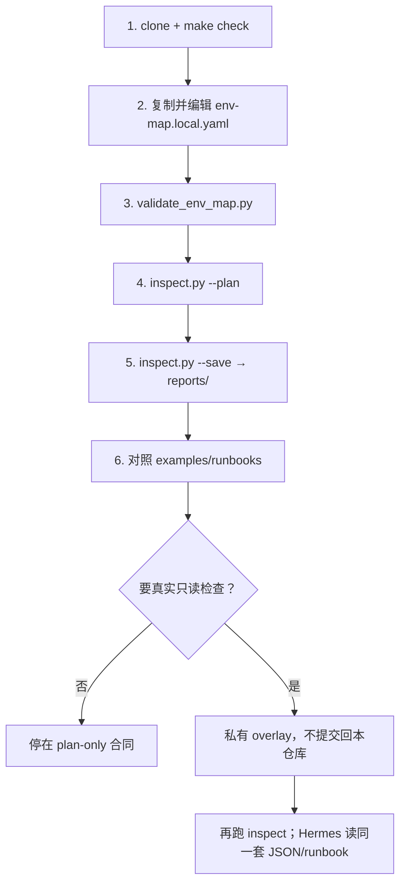

<p align="right">
  <b>简体中文</b> · <a href="clone-and-run.en.md">English</a>
</p>

# 使用流程

克隆之后按这条链路用。公开模板**不连接**真实 Kubernetes / SSH / 数据库。



更短的摘要在根目录 [README.md](../README.md)。合同串起来的例子见 [end-to-end-example.md](end-to-end-example.md)。

---

## 0. 依赖

- `git`、`python3`（3.11+ 即可）、`make`
- 不需要集群、kubeconfig 内容、数据库，也能跑完下面「第一次」
- 可选：本机已安装 Hermes Agent（只有做 `make health-check` 或让 Agent 读合同时才需要）

```bash
git clone <REPO_URL> hermes-ops-kit
cd hermes-ops-kit
```

---

## 第一次：验证公开模板

### 1. 跑仓库门禁

```bash
make check
```

这只检查**本仓库**：脚本编译、脱敏、env-map/catalog/runbook 合同、巡检骨架、单元测试。它**不会**检查本机 Hermes。可选模板（可能碰到 `~/.hermes`）：

```bash
make health-check
```

### 2. 建私有 env-map

```bash
cp config/env-map.example.yaml config/env-map.local.yaml
```

`env-map.local.yaml` 已被 `.gitignore` 忽略，**不要 commit**。只填路径、别名、凭据**来源**，不要填密码、token、kubeconfig 文件内容。

打开后至少改这些：

| 字段 | 怎么填 |
|---|---|
| `environments.<name>` | 环境名任意，如 `dev` / `test` / `staging` / `prd` |
| `kubeconfig` | 本机路径，例如 `~/.kube/config-test`，不要把文件内容贴进来 |
| `credentials.*.type` | `file` / `env` / `k8s_secret` / `external_secret` / `manual` |
| `credentials.*.path` 或 `variable` 或 `secret` | 来源定位符；`.pw` 只是 `file` 的一种示例 |
| `components.<name>.mode` | `auto` / `manual` / **`disabled`**（没有的中间件用 disabled） |
| `inspection.include` | 只列要跑的 check id，必须存在于 `config/check-catalog.yaml` |
| `inspection.exclude` | 要从 include/catalog 里跳过的 id |

没有 Redis / Longhorn 时：该组件 `mode: disabled`，并从 `inspection.include` 拿掉对应检查（如 `redis_health`、`longhorn_health`）。

合法检查项见 `config/check-catalog.yaml`。

### 3. 校验 env-map

把 `test` 换成你文件里的环境名：

```bash
python3 scripts/validate_env_map.py config/env-map.local.yaml --expect-env test --catalog config/check-catalog.yaml
```

应看到 `result=OK`。include/exclude 里出现 catalog 没有的 id 会失败；include 了 `disabled` 组件会告警。

### 4. 先规划巡检

```bash
python3 scripts/inspect.py test --config config/env-map.local.yaml --catalog config/check-catalog.yaml --plan --json
```

| 参数 | 含义 |
|---|---|
| 第一个参数 `target` | `all`，或 env-map 里**任意**环境名（不限于 dev/test/prd） |
| `--plan` | 只规划，checker 不执行 |
| `--execute-readonly` | 请求执行；**公开 checker 仍 skipped**，除非私有 overlay 注入 runner |
| `--json` | JSON 打到 stdout |
| `--save` | 写 `reports/<env>/inspection-<run_id>.json` 和 `.md`；路径提示在 **stderr** |
| `--reports-dir` | 默认 `reports/` |

公开侧你会看到大量 `status: skipped` 或 `mode: plan`，这是预期，不是故障。

### 5. 落盘报告

```bash
python3 scripts/inspect.py test --config config/env-map.local.yaml --json --save
```

产物（不要提交 `reports/`）：

```text
reports/test/inspection-<run_id>.json
reports/test/inspection-<run_id>.md
```

```bash
python3 scripts/render_summary.py reports/test/inspection-<run_id>.json --only-abnormal
python3 scripts/validate_inspection.py reports/test/inspection-<run_id>.json
```

### 6. 对照 Runbook

巡检条目的 `suggestion` 里会写 runbook `name`，例如 `Run k8s-pod-abnormal-diagnostic`。到这里找元数据：

```text
examples/runbooks/k8s-pod-abnormal-diagnostic.yaml
```

L0 只读，不需要审批。L1+ 才用 `templates/approval-request-template.json`（合同形状；本仓库没有审批中心）。

当前 L0 列表示例：[examples/runbooks/README.md](../examples/runbooks/README.md)。

### 7. 可选：onboard 候选

```bash
python3 scripts/onboard.py --env test --output config/env-map.generated.yaml --force
```

这是**草稿**，不是发现结果。公开 `onboard.py` 不扫真实集群。人工审阅后，你认为有用的字段才能合进 `env-map.local.yaml`。`env-map.generated.yaml` 也不要 commit。

---

## 日常

1. 改 `env-map.local.yaml` 的 include / disabled（环境变了才改路径和凭据来源）。
2. `validate_env_map.py`。
3. `inspect.py <env> --plan --json` 看会跑哪些检查。
4. 有私有 overlay 时再用 `--execute-readonly`（公开树仍然 skipped）。
5. `--save`，把 JSON/Markdown 交给自己或 Hermes 看。
6. 异常项对照 `examples/runbooks/*.yaml`。
7. 需要变更时走审批合同；**不要**让公开脚本执行 delete/restart/apply。

一次扫多个环境：

```bash
python3 scripts/inspect.py all --config config/env-map.local.yaml --catalog config/check-catalog.yaml --plan --json
```

`checks[].env` 用来区分同名检查属于哪个环境。

---

## 接真实只读检查

不要改公开 `scripts/checkers/*.py` 去连你的集群。在仓库外做 overlay：

```text
~/hermes-ops-private/
  env-map.local.yaml
  checkers/
  creds/
```

规则：只读、不要 `shell=True`、不要打印密码。模板见 [private-checker-guide.md](private-checker-guide.md) 和 `examples/private-checker-template.py`。

---

## 和 Hermes 一起用

本仓库**不会**自动挂到 Hermes。现在的用法是：

1. 本机 Hermes 继续跑你的 copilot。
2. 把 `config/env-map.local.yaml`、`examples/runbooks/`、`reports/*.json` 当作 Agent 的事实输入（路径自己指）。
3. 让 Agent 按 runbook 的 L0 步骤诊断，不要跳过预检查去执行 L2/L3。
4. 可复用的经验脱敏后再 PR 回本仓库，流程见 [local-hermes-to-ops-kit.md](local-hermes-to-ops-kit.md)。

---

## 和 BestNative

现在没有 BestNative 页面。以后控制面只读 `HERMES_OPS_KIT_PATH` 和本地 `reports/`。不要等 clone 后出现 Web UI。见 [product.md](product.md) 和 [bestnative-integration.md](bestnative-integration.md)。

---

## 不要做

- 提交 `env-map.local.yaml`、`env-map.generated.yaml`、`reports/`、`*.pw`、`.env`
- 把 kubeconfig / 密码贴进任何会进 Git 的文件
- 以为 `make check` 或公开 `inspect.py` 已经在巡检生产集群
- 在公开 checker 里写死集群地址或 `kubectl` 默认执行
