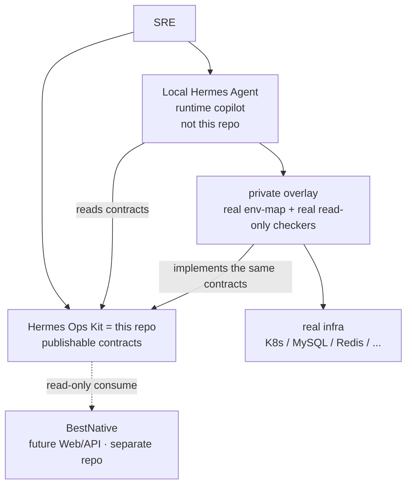
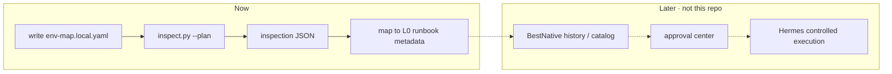

<p align="right">
  <a href="product.md">简体中文</a> · <b>English</b>
</p>

# Product

Current stage: **`v0.4-preview`**

## One sentence

Hermes Ops Kit is a **local-first AI SRE contract and runbook template kit** for Hermes Agent. It publishes the contracts for environment maps, inspection JSON, runbooks, and approval — it does not ship another agent.

## Positioning

**It is not a Hermes feature branch, and not a fork of Hermes.**

| Easy to mix up | Actual |
|---|---|
| A git branch / plugin that replaces `~/.hermes` | **A separate repo.** Hermes stays your local copilot; this kit only supplies contracts for it (and later BestNative) |
| An online ops platform / SaaS AIOps | No. There is no production Web UI and it does not host your cluster |
| A backup of a real environment | No. The public tree has placeholders and schemas only |
| BestNative | No. BestNative is a future separate control plane that will read this kit |

```text
Hermes Agent     = runtime (reasoning, tools, real ops loop)     stays in ~/.hermes
Hermes Ops Kit   = contract layer (env-map / catalog / runbook / approval schema)  this repo
BestNative       = control plane (assets, history, approval, audit UI/API)  separate repo, not started
private overlay  = your real read-only checks and real env-map      do not commit it back
```



Experience proven in local Hermes may be sanitized into this kit. This kit **never** inspects or mutates a running Hermes unless you explicitly run the optional `make health-check` template.

The end-state platform is in [../future-product/](../future-product/README.md) — planning only.

---

## Problem

Without contracts, AI ops turns into guessing commands:

- Environment facts live in people's heads and chat logs
- Inspection output shape changes every time, so history and UI are hard
- Experience cannot be shared without leaking IPs, hostnames, or passwords
- High-risk ops have no shared approval/rollback fields

Ops Kit turns those into **stable contracts** first, then Hermes reasons against them.

---

## Capabilities now

These are what **this repository** already provides — not BestNative, and not every local Hermes skill.

| Capability | What you get |
|---|---|
| **env-map contract** | YAML for env names, kubeconfig **paths**, credential **sources**, include/exclude; no password values |
| **check catalog** | K8s / MySQL / Redis / RabbitMQ / ES / node / ArgoCD / Longhorn checks and checker names |
| **inspect.py** | `all` or any env name; public default is plan-only; JSON + Markdown output |
| **Runbook metadata** | L0 read-only diagnostic examples (not full production SOPs) |
| **Approval/audit contract** | schema + request template; **no** approval center implementation yet |
| **Sanitize and gates** | `sanitize_check.py`, publish-guard, `make check` |
| **Private overlay path** | Real read-only checks stay in your overlay, not the public tree |
| **BestNative read-only contract** | Which files a control plane may read, and minimum inspection JSON fields |

Public scripts **do not** connect to Kubernetes, SSH, databases, or external HTTP. `--execute-readonly` stays skipped in the public tree.

---

## Advantages

1. **Private-first** — topology and credentials stay in `env-map.local.yaml` and a private overlay; GitHub gets the skeleton.
2. **Facts before reasoning** — env-map + catalog + inspection JSON reduce hallucinated commands.
3. **Shareable without leaking** — teams reuse the same check and runbook shape without copying `~/.hermes`.
4. **Safe defaults** — public side is plan-only; L2/L3 contracts require approval, rollback, and audit fields; PRD defaults to commands only.
5. **Decoupled from runtime** — Hermes upgrades should not glue ops contracts into agent source.
6. **Control-plane ready** — BestNative does not invent a second inspection JSON.
7. **Optional middleware** — unused Redis / Longhorn: `mode: disabled` and drop from include; credentials are not locked to `.pw` files.

---

## Who it is for

- People already using Hermes Agent who want reusable SRE contracts
- Teams that need a public inspection / runbook / approval schema instead of open-sourcing a local copilot
- Future BestNative implementers of a read-only control plane

Not for: anyone who expects clone-then-auto-repair production. That is not this repo's goal.

---

## How the layers work together



How local experience is sanitized into this repo: [local-hermes-to-ops-kit.md](local-hermes-to-ops-kit.md).

---

## Relationship to BestNative

BestNative is **not** part of this repository and is **not integrated yet**. It is a planned separate Web/API control plane. This kit is its **contract provider**.

```text
BestNative  = control plane for humans (separate codebase)
Ops Kit     = contracts for machines (this repo)
Hermes      = runtime that actually reasons and acts (local)
```

| Who | Owns | Does not own |
|---|---|---|
| **Ops Kit (now)** | env-map / catalog / inspection JSON / runbook / approval **field contracts**; plan-only scripts | BestNative pages, database, adapter code |
| **BestNative (later, separate repo)** | UI/API: assets, history, catalog, approval queue, audit timeline | reinventing schemas; storing passwords; mutating kit sources |
| **Hermes** | Diagnose against contracts; execute L2/L3 only after approval | being a Web control plane |

Sequence (all in the BestNative repo, not here):

1. **Build BestNative as its own repo** (minimal Web/API, no execution).
2. **Phase 1 read-only**: `HERMES_OPS_KIT_PATH`, show catalog, runbook examples, local `reports/*.json`. No execution API.
3. **Phase 2 approval/audit**: persist state from `approval.schema.yaml`; no L2/L3 without an approval id.
4. **Phase 3 controlled execution**: after RBAC, command hashing, and rollback, bridge to Hermes.

How they connect: [bestnative-integration.en.md](bestnative-integration.en.md)

Rules:

- Keep the two repos separate until [../future-product/merge-readiness.md](../future-product/merge-readiness.md)
- Do not fork schemas; follow this repo's `schema_version`
- Credential values do not go into a BestNative database
- Adapter code does not go into this repo

Readable files: [bestnative-contract.en.md](bestnative-contract.en.md)

---

## Non-goals

- Do not replace Prometheus / Elasticsearch / Alertmanager
- Do not run kubectl / SQL / SSH in the public tree
- Do not ship Hermes Agent source or `~/.hermes` in this repo
- Do not implement a BestNative adapter or approval state machine here

How to use: [clone-and-run.en.md](clone-and-run.en.md) · Architecture: [architecture.en.md](architecture.en.md) · Root README: [../README.en.md](../README.en.md)
