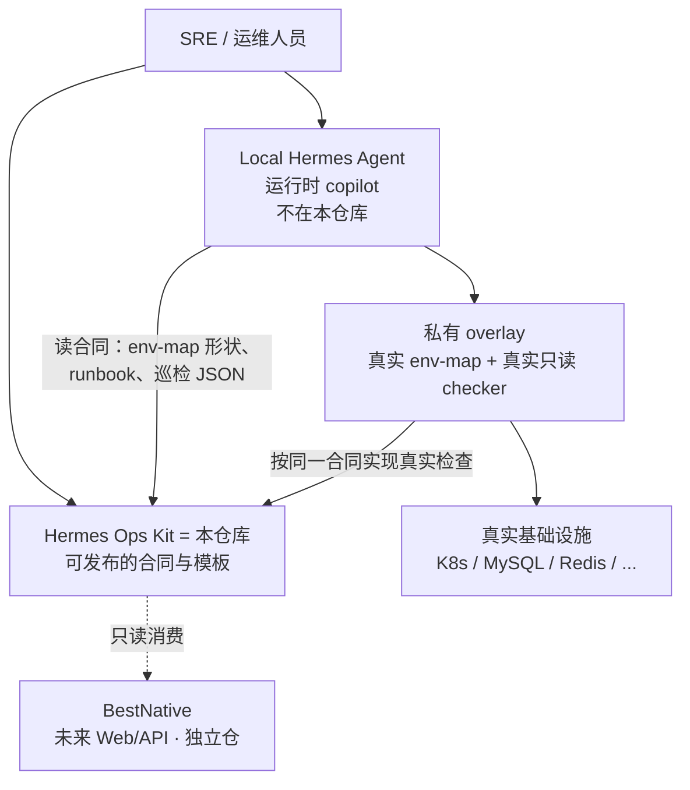
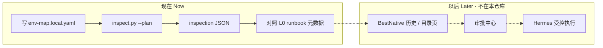
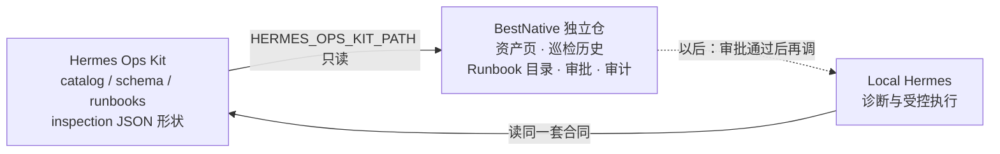

# 产品描述 / Product

当前阶段 Current stage: **`v0.4-preview`**

## 一句话 / One sentence

Hermes Ops Kit 是给 Hermes Agent 用的**本地优先 AI SRE 契约与 Runbook 模板包**。它把「环境怎么描述、巡检出什么 JSON、Runbook 长什么样、什么操作要审批」写成可脱敏发布的合同，而不是再做一个 Agent。
Hermes Ops Kit is a **local-first AI SRE contract and runbook template kit** for Hermes Agent. It publishes the contracts for environment maps, inspection JSON, runbooks, and approval — it does not ship another agent.

## 实际定位 / Actual positioning

**它不是 Hermes 的功能分支，也不是 Hermes 的 fork。**
It is **not** a feature branch of Hermes, and **not** a fork of Hermes.

| 容易混淆的说法 Easy to mix up | 实际 Actual |
|---|---|
| Hermes 的一个 git branch / plugin 替换 `~/.hermes` | **独立仓库**。Hermes 仍是你本机的 copilot；本仓库只提供它（以及未来 BestNative）可消费的合同 |
| 在线运维平台 / SaaS AIOps | 不是。没有生产 Web UI，也不托管你的集群 |
| 真实环境备份 | 不是。公开树只有占位符和 schema |
| BestNative | 不是。BestNative 是未来独立控制面，只读消费本仓库 |

关系可以记成：

```text
Hermes Agent     = 运行时（推理、工具、真实操作循环）     留在本机 ~/.hermes
Hermes Ops Kit   = 合同层（env-map / catalog / runbook / 审批 schema）  本仓库
BestNative       = 控制面（资产、历史、审批、审计 UI/API）  独立仓，尚未实现
私有 overlay     = 你自己的真实只读检查与真实 env-map      不提交回本仓库
```



本地 Hermes 里验证过的经验，脱敏后才进入本仓库；本仓库**从不**去探查或修改你正在运行的 Hermes。
Experience proven in local Hermes may be sanitized into this kit. This kit **never** inspects or mutates a running Hermes unless you explicitly run the optional `make health-check` template.

终局三层合成「AI SRE Runbook Platform」见 [../future-product/](../future-product/README.md)（规划，非当前实现）。
The end-state platform is in [../future-product/](../future-product/README.md) — planning only.

---

## 解决什么问题 / Problem

没有合同的 AI 运维容易变成「临场猜命令」：

- 环境事实散落在个人记忆和聊天记录里
- 巡检结果每次形状不同，无法做历史和 UI
- 经验无法脱敏分享，一分享就带上 IP / 主机名 / 密码
- 高风险操作没有统一的审批/回滚字段

Ops Kit 把这些先变成**稳定合同**，再让 Hermes 按合同推理，而不是 YOLO。

---

## 当前能力 / Capabilities now

这些是**本仓库已经提供的**，不是 BestNative，也不是本机 Hermes 的全部技能。

| 能力 Capability | 你得到什么 You get |
|---|---|
| **环境地图合同** env-map | 用 YAML 描述环境名、kubeconfig **路径**、凭据**来源**、include/exclude；不含密码值 |
| **检查目录** check catalog | K8s / MySQL / Redis / RabbitMQ / ES / 节点 / ArgoCD / Longhorn 等检查项与 checker 名 |
| **巡检分发** `inspect.py` | `all` 或任意环境名；公开默认 plan-only，产物是 JSON + Markdown |
| **Runbook 元数据** | L0 只读诊断示例（不是生产 SOP 全文） |
| **审批/审计合同** | schema + 请求模板；**还没有**审批中心实现 |
| **脱敏与门禁** | `sanitize_check.py`、`publish-guard`、`make check` |
| **私有 overlay 路径** | 真实只读检查接在你自己的 overlay 上，不污染公开树 |
| **BestNative 只读合同** | 标明控制面可以读哪些文件、巡检 JSON 最低字段 |

公开脚本**不会**连接 Kubernetes、SSH、数据库或外部 HTTP。`--execute-readonly` 在公开树里仍然 skipped。
Public scripts **do not** connect to Kubernetes, SSH, databases, or external HTTP. `--execute-readonly` stays skipped in the public tree.

---

## 优势 / Why this shape

1. **本地优先 / Private-first**  
   真实拓扑和凭据留在 `env-map.local.yaml` 和私有 overlay；GitHub 上只有骨架。

2. **先给 AI 事实，再让它推理**  
   env-map + catalog + 巡检 JSON 是稳定输入，减少「幻觉命令」。

3. **可分享但不泄密**  
   团队可以复用同一套检查项和 Runbook 形状，不必复制 `~/.hermes`。

4. **安全默认**  
   公开侧 plan-only；L2/L3 在合同里就要求审批、回滚、审计字段；PRD 默认只出命令。

5. **和运行时解耦**  
   Hermes 升级、换模型、换技能，不需要把运维合同绑死在 Agent 源码里。

6. **给未来控制面留接口**  
   BestNative 不必再发明一套巡检 JSON；读本仓库即可。

7. **中间件可裁剪**  
   没有 Redis / Longhorn 就 `mode: disabled` 并从 include 拿掉；凭据来源不绑死 `.pw` 文件。

---

## 给谁用 / Who it is for

- 已经在用 Hermes Agent、希望把 SRE 经验变成可复用合同的人
- 需要一份可公开的巡检 / Runbook / 审批 schema，而不是把本机 copilot 开源出去的团队
- 未来做 BestNative 只读控制面的实现者

不适合：期望 clone 之后立刻连上生产集群并自动修复的人。那不是本仓库的目标。

---

## 和相邻层怎么配合 / How the layers work together



数据回流（经验进入 kit）见 [local-hermes-to-ops-kit.md](local-hermes-to-ops-kit.md)。
How local experience is sanitized into this repo: [local-hermes-to-ops-kit.md](local-hermes-to-ops-kit.md).

---

## 和 BestNative 的关系 / Relationship to BestNative

BestNative **不是**本仓库的一部分，也还**没有打通**。它是计划中的独立 Web/API 控制面；本仓库是它的**合同供应商**。
BestNative is **not** part of this repository and is **not integrated yet**. It is a planned separate Web/API control plane. This kit is its **contract provider**.

```text
BestNative  = 给人看、做历史、做审批的控制面（独立代码库）
Ops Kit     = 给机器读的合同（本仓库）
Hermes      = 真正推理和操作的运行时（本机）
```



| 谁 Who | 负责 Owns | 不负责 Does not own |
|---|---|---|
| **Ops Kit（现在）** | env-map / catalog / 巡检 JSON / runbook / 审批 **字段合同**；plan-only 脚本 | BestNative 页面、数据库、适配器代码 |
| **BestNative（以后，独立仓）** | 把合同渲染成 UI/API：资产、历史、目录、审批单、审计时间线 | 重新发明一套 schema；存密码；改 kit 源码 |
| **Hermes** | 按合同诊断；审批通过后才执行 L2/L3 | 当 Web 控制面 |

接入顺序（都在 BestNative 仓做，不写进本仓库）：

1. **先做 BestNative 独立仓**（最小 Web/API，还不要执行）。
2. **一期只读**：配置 `HERMES_OPS_KIT_PATH`，展示 catalog、runbook 示例、本地 `reports/*.json`。没有执行 API。
3. **二期审批/审计**：按本仓库 `approval.schema.yaml` 存状态；没有 approval id 就不能跑 L2/L3。
4. **三期受控执行**：RBAC + 命令哈希 + 回滚齐了，再桥接 Hermes。

怎么联动的图和路径约定：[bestnative-integration.md](bestnative-integration.md)。
How they connect (diagram and path convention): [bestnative-integration.md](bestnative-integration.md).

硬规则：

- 两个仓保持独立，合仓条件见 [../future-product/merge-readiness.md](../future-product/merge-readiness.md)
- BestNative 不要 fork 一份 schema 自己演化，跟本仓库 `schema_version`
- 凭据值不进 BestNative 数据库
- 适配器代码不进本仓库

可读文件清单：[bestnative-contract.md](bestnative-contract.md) · 分阶段计划：[bestnative-integration.md](bestnative-integration.md)

---

## 现在不做 / Non-goals

- 不替代 Prometheus / Elasticsearch / Alertmanager
- 不在公开树执行 kubectl / SQL / SSH
- 不把 Hermes Agent 源码或 `~/.hermes` 打进本仓库
- 不在本仓库实现 BestNative 适配器或审批状态机

上手：[clone-and-run.md](clone-and-run.md) · 架构：[architecture.md](architecture.md) · 根 README：[../README.md](../README.md)
